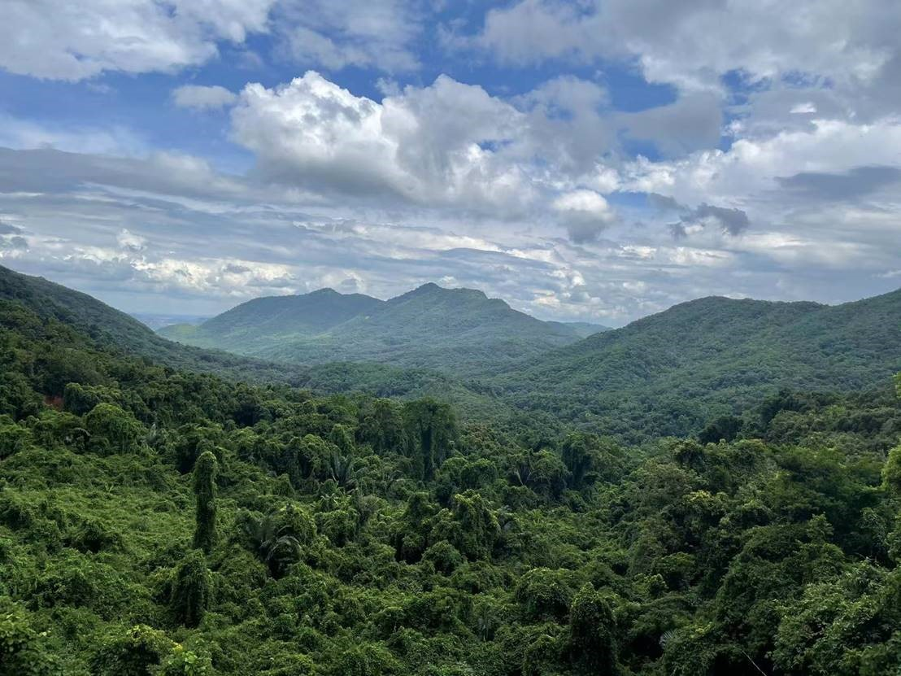
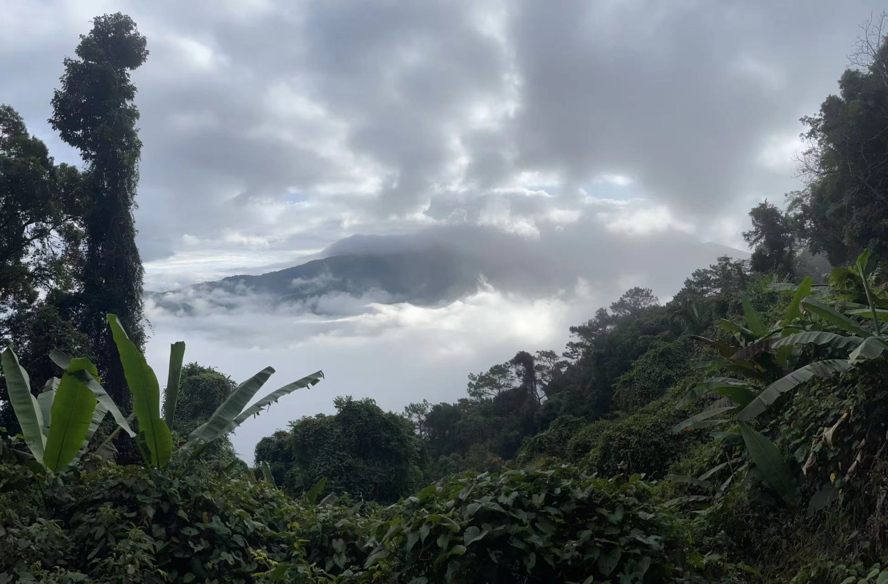

```{r setup, include=FALSE}
knitr::opts_chunk$set(echo = TRUE)
```

<br>

## Mt. Bawangling (海南霸王岭)

Bawangling is located in Hainan Island, South China (18°52′-19°12′ N, 108°53′-109°20′ E). Bawangling covers one of the largest areas of tropical rain forests in China. It is ca. 500 km2 with an elevation range of ca. 100–1654 m a.s.l. The mean annual air temperature varies from 23.6°C (ca. 100 m a.s.l.) to 16.7°C (ca. 1400 m a.s.l.). The precipitation is seasonal distributed, with a rainy season between May to October and a dry season between November to April.

<div align="center">
```{r DT, echo=FALSE, message=FALSE, warning=FALSE}
# example: https://www.earthdatascience.org/courses/earth-analytics/get-data-using-apis/leaflet-r/
library(dplyr)
library(ggplot2)
library(rjson)
library(jsonlite)
library(leaflet)
library(RCurl)
library(openxlsx)
dat <- read.xlsx("I:\\Research\\BEST\\BEST_Documents\\Locations_Best_Current.xlsx")
dat <- dat[which(dat$Name=="Bawangling"),]
best_map <- leaflet() %>%
  addProviderTiles("Esri.NatGeoWorldMap") %>%
  addCircleMarkers(color = "red", stroke = FALSE, fillOpacity = 0.5, lng=dat$long, lat=dat$lat, popup=dat$NameCN)%>%
  setView(dat$long[1], dat$lat[1], zoom = 8)
best_map
```
</div>

<hr>

### **Vegetation**

Topographic and climatic variations in Bawangling result in a vertical zonation of major forest types. The vegetation types in the Bawangling region from low to high altitudes are deciduous monsoon forest (0- 500 m a.s.l.), tropical lowland rain forest (0–700 m a.s.l), tropical conifers forest (500–700 m a.s.l), tropical montane rain forest (800–1300 m a.s.l), tropical montane evergreen forest (1200–1400 m a.s.l) and tropical dwarf forest (above 1300 m a.s.l).

[](Pictures/Bawangling-1.jpg){#id .class width=30% height=30%}

[](Pictures/Bawangling-2.jpg){#id .class width=30% height=30%}

<hr>

### **Flora**

The flora of Bawangling is very rich, harboring > 2,213 vascular plant species, belonging to 967 genera and 220 families.

<hr>

### **Fauna**

Coming soon.

<hr>

### **Research sites of BEST network**

The elevational transect of our study spans ~1,200 m in elevation from 265 to 1,400 m and consists of 12 sites, each with a 20×20m permanent sampling plot, all in old growth forest. Within each plot, all woody stems with ≥ 1 cm DBH were tagged and identified to species. There were 4249 individuals with DBH ≥ 1 cm recorded, belonging to 369 woody plant species.

<hr>

### **Principal Investigator**

Yi Ding (丁易): [dingyi@caf.ac.cn](mailto:dingyi@caf.ac.cn)

Lan Liu (刘兰): [liulan_sh@qq.com](mailto:liulan_sh@qq.com)

**Research Team**:

-  Dr. Wenxing Long (Hainan University)

-  Xiaoran Wang (East China Normal University)

-  Jian Zhang (East China Normal University)

<hr>

### **Selected Publications**

1)	Ding, Y., Liu, G., Zang, R., Zhang, J., Lu, X., Huang, J., 2016. Distribution of vascular epiphytes along a tropical elevational gradient: disentangling abiotic and biotic determinants. Scientific Reports 6, 1-11.

2)	Ding, Y., Zang, R., Letcher, S.G., Liu, S., He, F., 2012. Disturbance regime changes the trait distribution, phylogenetic structure and community assembly of tropical rain forests. Oikos 121, 1263-1270.

3) Ding, Y., Zang, R., Lu, X., Huang, J., Xu, Y., 2019. The effect of environmental filtering on variation in functional diversity along a tropical elevational gradient. Journal of Vegetation Science 30, 973-983.

4) Long, W., Ding, Y., Zang, R., Yang, M., Chen, S., 2011. Environmental characteristics of tropical cloud forests in the rainy season in Bawangling National Nature Reserve on Hainan Island, South China. Chinese Journal of Plant Ecology 35, 137-146.

<hr>

### **Site Support**

This site has been supported by:

-   Bawangling National Nature Reserve

-   National Natural Science Foundation of China

-   Hainan University

-   East China Normal University

<hr>