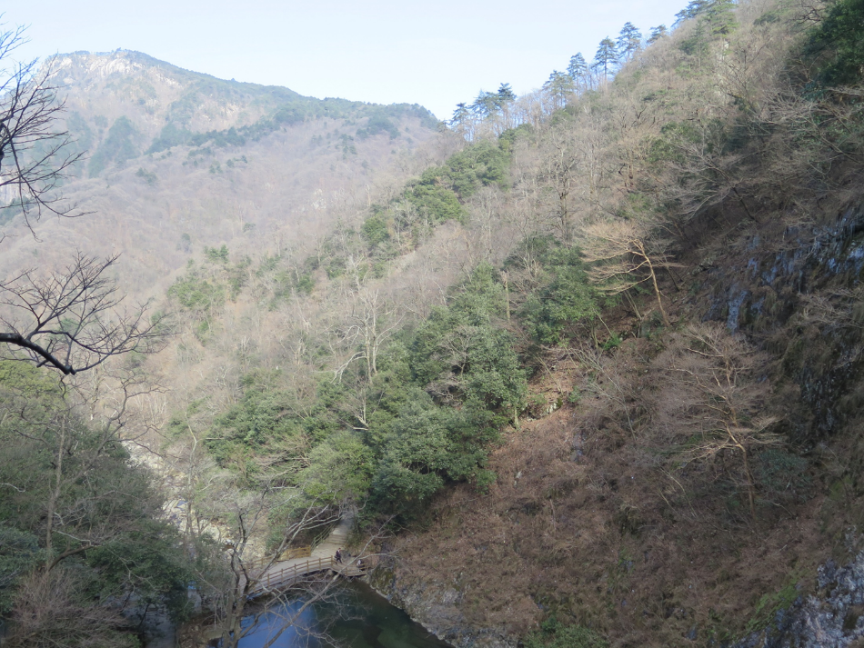
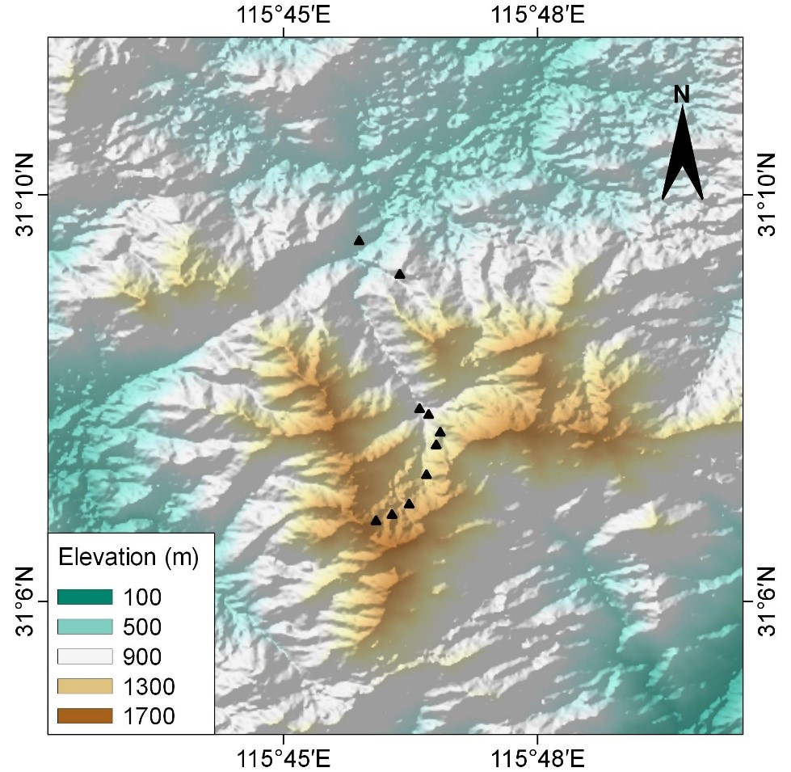
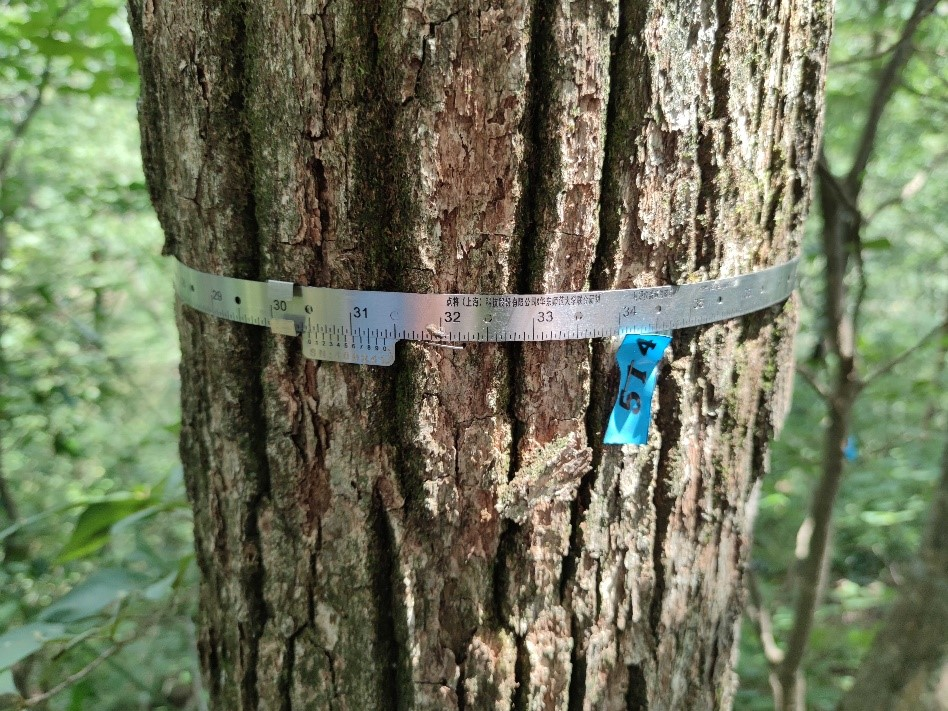
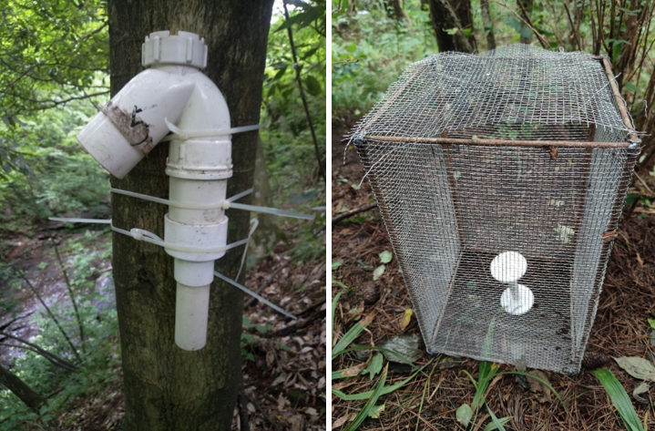

```{r setup, include=FALSE}
knitr::opts_chunk$set(echo = TRUE)
```

<br>

## Mt. Dabieshan (安徽大别山)

The study sites was conducted in Tianma National Nature Reserve, located at the junction of Anhui, Henan and Hubei provinces (115°20′～115°50′ E, 30°10′～31°20′ N). The region is characterized by a subtropical moist monsoon climate, with mean annual temperature of 13.8℃. Extreme temperatures of 38.1℃ and -23℃ have been recorded in July and January, respectively. The mean annual precipitation is 1489 mm, with most precipitation from May to September.

[{width="20cm"}](Pictures/Dabieshan-2.png)

<div align="center">
```{r DT, echo=FALSE, message=FALSE, warning=FALSE}
# example: https://www.earthdatascience.org/courses/earth-analytics/get-data-using-apis/leaflet-r/
library(dplyr)
library(ggplot2)
library(rjson)
library(jsonlite)
library(leaflet)
library(RCurl)
library(openxlsx)
dat <- read.xlsx("I:\\Research\\BEST\\BEST_Documents\\Locations_Best_Current.xlsx")
dat <- dat[which(dat$Name=="Dabieshan"),]
best_map <- leaflet() %>%
  addProviderTiles("Esri.NatGeoWorldMap") %>%
  addCircleMarkers(color = "red", stroke = FALSE, fillOpacity = 0.5, lng=dat$long, lat=dat$lat, popup=dat$NameCN)%>%
  setView(dat$long[1], dat$lat[1], zoom = 8)
best_map
```
</div>

<hr>

### **Vegetation**

This region is a transition area from evergreen broadleaved forest to deciduous broadleaved forest and consists of a mixture of the two types of forests. The vegetation change from evergreen broadleaved forests to deciduous broadleaved forests with increasing elevation. Conifer forests and shrubs dominate near mountain ridge above 1300m a.l.t.

[](Pictures/Dabieshan-3.png){#id .class width=30% height=30%}

Evergreen and deciduous mixed forests of of \~ 1050 m

<hr>

### **Flora**

According to the historical reports, there are 176 moss species in 94 genera of 50 families; 116 fern species in 60 genera of 29 families; and 1676 seed plant species in 655 genera of 155 families, including 13 gymnosperms species in 8 genera of 6 families and 1663 angiosperms species in 647 genera of 149 families.
<hr>

### **Fauna**

According to the historical reports, there are 47 fish species in 45 genera of 16 families; 26 amphibian species in 15 genera of 8 families; 38 reptile species in 34 genera of 9 families; 283 bird species in 170 genera of 66 families; and 35 mammal species in 16 genera of 6 families.

The Dabie Mountains are the transitional area between the Palearctic realm and the Oriental realm. In the Dabie Mountains, there are differentiations in the species composition and populations size of animal from the north to the south. In the fauna of China, the Dabie Mountains belongs to Eastern hilly plains subregion, Central China fauna region. The species distributed in the Dabie Mountains belong to the subtropical forest shrub-grassland-farmland animals. The mammals are characterized by abundant arboreal rodents, carnivores and artiodactylous. The most common herbivores in this area are the Reeves's muntjac (*Muntiacus reevesi*) and wild boar (*Sus scrofa*). The Anhui musk deer (*Muschus anhuiesis*), a species of wild animals under state priority conservation (Level-I), is only distributed in this area.

In the Dabie Mountains, birds composition have different distributions with altitude and vertical vegetation belts. It is worth noting that the Dabie Mountain is the main distribution area of the Reevee’s Pheasant (*Syrmaticus reevesii*), the level-Ⅱ species under state priority conservation. At the same time, there is also a unique subspecies of *Koklass Pheasant*, *Pucrasia macrolopha joretiana*. In addition, the fauna of amphibians and reptiles has obvious transition characteristics, and there are a lots of endemic species, such as the Anhui Tree Frog (*Rhacophorus zhoukaiyae*), Dabieshan Knobby Newt (*Yaotriton dabienicus*), Anhui Knobby Newt (*Yaotriton anhuiensis*), Shangcheng Stout Salamander (*Pachyhynobius shangchengensis*), Anhui Brown frog (*Rana dabieshanensis*), Ye’s Spiny-vented frog (*Yerana yei*), Dabie Mountains Pit Viper (*Protobothrops dabieshanensis*). The endemic species reflect that the Dabie Mountain acted as refuge during the Quaternary Ice Age time.

<hr>

### **Research sites of BEST network**

In 2018-2019, ten 20 m × 20 m plots along an elevational gradient were set up from 647 m to 1586 m above the sea level in this mountain. The plots were set at intervals of ~100 m in elevation. Within each plot, all woody stems with ≥ 1 cm DBH were tagged and identified to species. There were 1745 individuals with DBH ≥ 1 cm recorded, belonging to 133 species.

{width="20cm"}

*The location of 10 long-term monitoring plots along elevation*
<br>

{width="20cm"}

*Installed metal band-dendrometers for 535 stems*
<br>

{width="20cm"}

*Monitoring air & soil temperature and moisture for each plot*
<hr>

### **Principal Investigator**
Kun Song (宋坤): [ksong@des.ecnu.edu.cn](mailto:ksong@des.ecnu.edu.cn)

Baowei Zhang (张保卫): [zhangbw@ahu.edu.cn](mailto:zhangbw@ahu.edu.cn)

<br>

**Research Team**:

-   Dr. Xijin Zhang (East China Normal University)
<hr>

### **Selected Publications**

1)	*Zhang XJ*, *Song K*, Pan YJ, Gao ZW, Pu FG, Lu JH, Shang KK, Da LJ, Ellen C. 2020. Responses of leaf traits to low temperature in an evergreen oak at its upper limit. ***Ecological Research***, 35: 900-911.
2)	*Zhang XJ*, *Song K*, Pu FG, Gao ZW, Ni TP, Chu XH, Wang ZY, Shang KK, Da LJ. 2019.Study on compositions of parenchyma in twigs of woody saplings in Dabie Mountains, Anhui, China. ***Chinese Journal of Plant Ecology***, 43(3): 238-244.
3)	*Song K*, Kohyama TS, Da LJ. 2014. Transition patterns across an evergreen–deciduous broad-leaved forest ecotone: the effect of topographies. ***Journal of Vegetation Science***, 25:1257-1266. 
4)	Wenliang Zhou, Tao Pan, Bin Li, Jinyun Chen, Tao Song, Zhaojie Peng, Guochen Zhang, Faguang Pu, *Baowei Zhang*. 2013. Camera trapping survey of mammals and birds in Tianma National Nature Reserve, China. ***Biodiversity Science***, 22(6): 776-778.
5)	Lei Zhou, Yaqiong Wan, Xin Hong, Heng Zhang, Lifu Qian, Chencheng Wang, Zheng Kong, Kai Zhao, Jiaqi Li, *Baowei Zhang*. 2018. Camera-trapping surveys of the large and medium-sized mammal and understory bird diversity in Yaoluoping National Nature Reserve, Anhui Province. ***Biodiversity Science***, 26(12): 1338–1342.
<hr>

### **Site Support**

This site has been supported by:

-   National Natural Science Foundation of China

-   School of Ecological and Environmental Sciences, East China Normal University

-   Tianma National Nature Reserve

-   Anhui Dabie Mountain Forest Ecosystem National Observation Station
<hr>