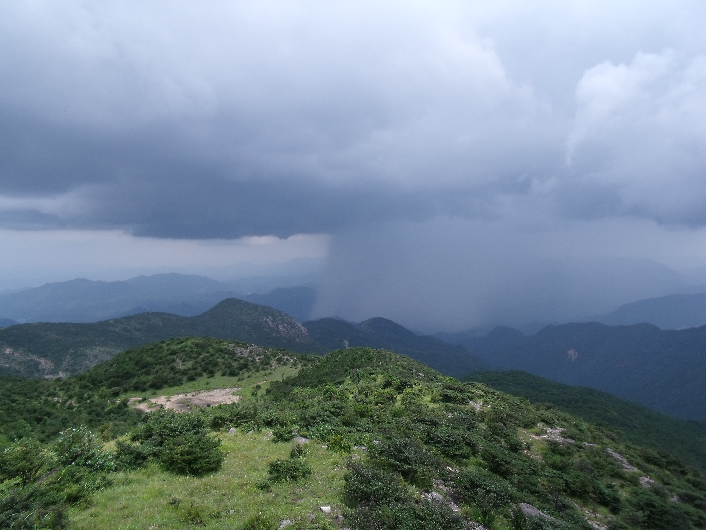
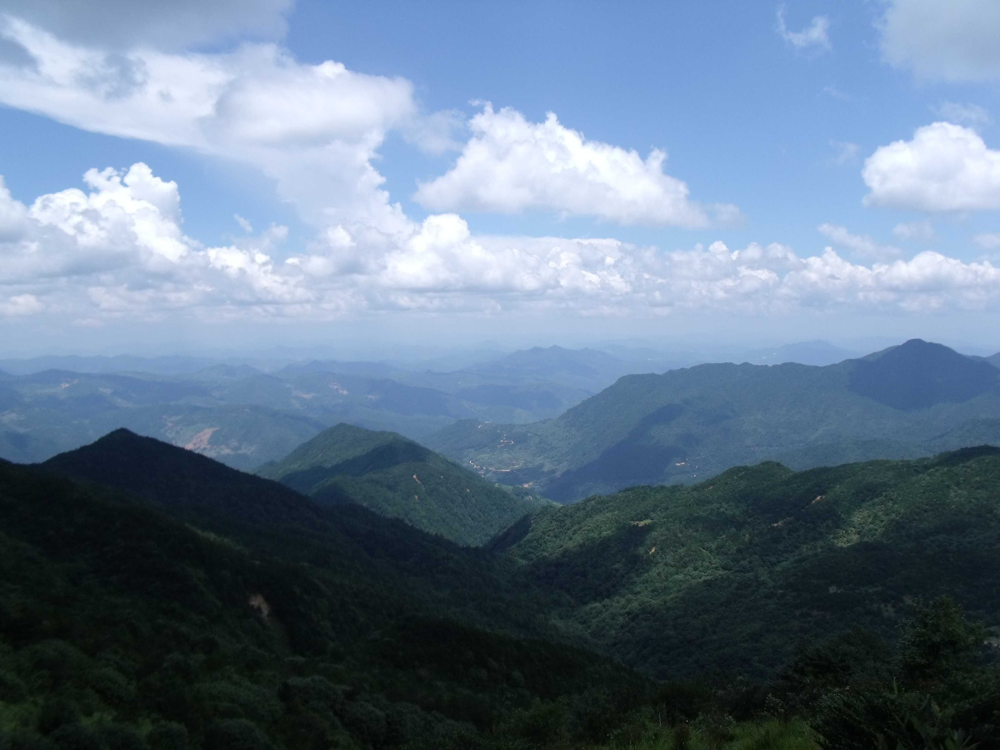
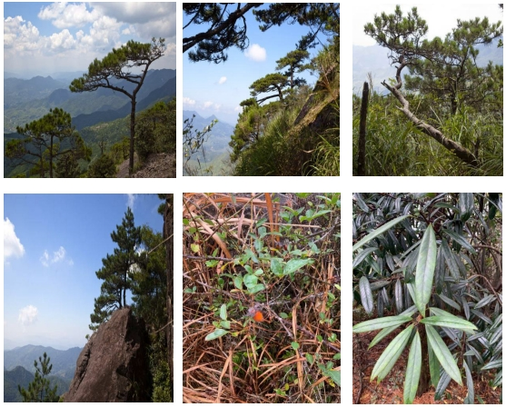
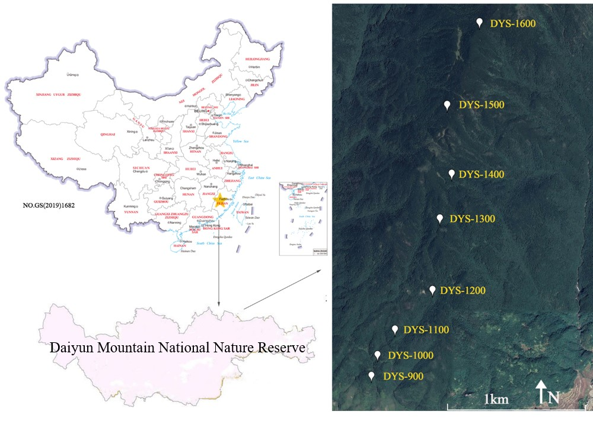
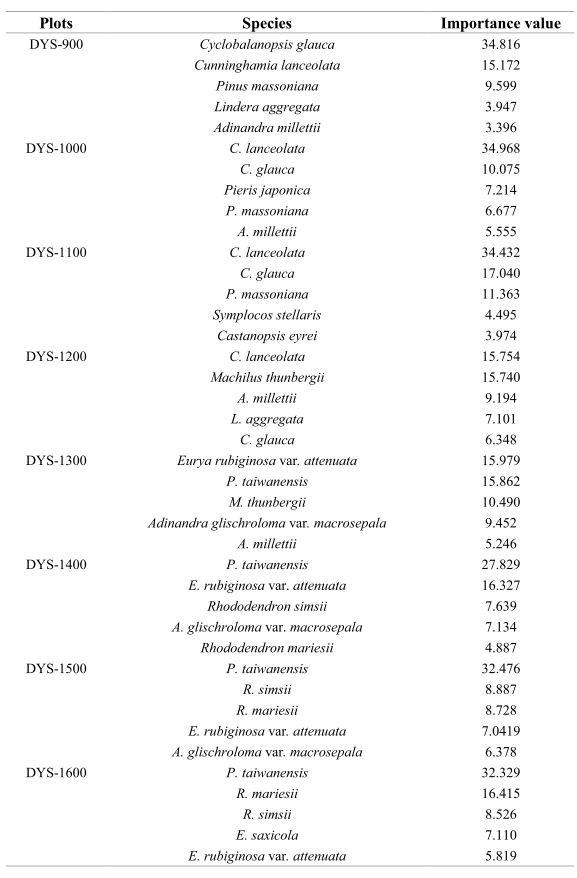

```{r setup, include=FALSE}
knitr::opts_chunk$set(echo = TRUE)
```

<br>
<br>
<br>

## Daiyunshan (戴云山)

Daiyun Mountain National Nature Reserve (25°38′07″~25°43′40″N, 118°05′22″~110°20′15″E) is located in Dehua County, Fujian Province, China. The highest peak of the mountain has a maximum elevation of 1856 m. The total area of the reserve is 134.72 km2. The study site has a southern subtropical and mid-subtropical climate with an average annual temperature of 15.6–19.5◦C. The extreme minimum temperature is 16.8°C, and extreme maximum temperature is 36.6°C. The average annual precipitation is about 1700–2000 mm, along with average annual relative humidity of 80%.

<div align="center">
```{r DT, echo=FALSE, message=FALSE, warning=FALSE}
# example: https://www.earthdatascience.org/courses/earth-analytics/get-data-using-apis/leaflet-r/
library(dplyr)
library(ggplot2)
library(rjson)
library(jsonlite)
library(leaflet)
library(RCurl)
library(openxlsx)
dat <- read.xlsx("I:\\Research\\BEST\\BEST_Documents\\Locations_Best_Current.xlsx")
dat <- dat[which(dat$Name=="Daiyunshan"),]
best_map <- leaflet() %>%
  addProviderTiles("Esri.NatGeoWorldMap") %>%
  addCircleMarkers(color = "red", stroke = FALSE, fillOpacity = 0.5, lng=dat$long, lat=dat$lat, popup=dat$NameCN)%>%
  setView(dat$long[1], dat$lat[1], zoom = 8)
best_map
```
</div>

<hr>

### **Vegetation**

The typical vegetation types are coniferous and evergreen broad-leaved forest. With the increase of elevation, the vertical band spectrum appears as follows: evergreen broad-leaved forest (650-1000 m), coniferous and broad-leaved mixed forest (1000-1200 m), temperate coniferous forest (1200-1650 m), mossy dwarf spring forest (1650-1765 m) and meadow (above 1750 m).

[](Pictures/Daiyunshan-1.jpg){#id .class width=30% height=30%}

[](Pictures/Daiyunshan-2.jpg){#id .class width=30% height=30%}

<hr>

### **Flora**

The vegetation arbor layer of the Daiyunshan Mountains is mainly composed of *Pinus taiwanensis*, *Clethra cavaleriei*, and *Rhododendron farrerae*, etc. The shrub layer mainly includes *Eurya saxicola*, *E. rubiginosa* and *Ilex crenata*, etc. The herbaceous layer mainly includes *Diplopterygium glaucum*, *Woodwardia japonica*, and *Lophatherum gracile*, etc. The *P. taiwanensis* is the most representative plant in Daiyun Mountain. The Daiyun Mountain has the best-preserved virgin *P. taiwanensis* forest community of more than 6 000 hm2 in mainland China, which mainly distributed at elevation of 1000-1800 m.

<div align="center">
[](Pictures/Daiyunshan-5.jpg)
</div>

<hr>

### **Fauna**

Daiyun Mountain is an important biodiversity gene bank and a treasure house of rare wild animals in Fujian Province. It contains rare wild animals including: *Muntiacus reevesi*, *Muntiacus vaginalis*, *Arctonyx collaris*, *Systematicus ellioti*, *Tragopan cabotiArctonyx collaris*, *Lophura nythemera*, *Callosciurus erythraeus*, *Mustela sibirica*, *Capricornis milneedwardsii*, *Panthera pardus*, *Neofelis nebulosa*, *Manis pentadactyla*, *Garrulax pectoralis*, *Arborophila gingica*, *Bambusicola thoracica, etc.

<div align="center">
[](Pictures/Daiyunshan-6.jpg)
</div>

<hr>

### **Research sites of BEST network**

In order to reduce the impact of human disturbance, the elevation gradients of Daiyun Mountain were set ranging from 900 m to 1600 m with the interval of 100 m. Eight permanent sample plots were set along elevation gradients in Daiyun Mountain. Each elevation set one a sample plot of 20 m ×30 m, and each plot was divided into three quadrat of 10 m ×20 m. The sample plots were selected from a representative forest community. Slope, aspect and other topographic factors of each plot were also measured by compass and iButton. All species with DBH above 1 cm in the plot were labeled and investigated, and species name, diameter and height were also recorded.

<div align="center">
[](Pictures/Daiyunshan-4.jpg)
</div>


<div align="center">
**The top five important value tree species in each elevation ranging from 900m to 1600 m**

[](Pictures/Daiyunshan-7.jpg)
</div>

<hr>

### **Principal Investigator**

-  Zhongsheng He (何中声): [jxhzs85@fafu.edu.cn](mailto:jxhzs85@fafu.edu.cn)

-  Xiaolei Huang (黄晓磊): [huangxl@fafu.edu.cn](mailto:huangxl@fafu.edu.cn)

**Research Team**:

-  Dr. Jinfu Liu/刘金福 (College of Forestry, Fujian Agriculture & Forestry University)

-  Dr. Daowei Xu/徐道炜 (College of Forestry, Fujian Agriculture & Forestry University)

-  Dr. Shiqun Zheng/郑世群 (College of Forestry, Fujian Agriculture & Forestry University)

-  Wenwei CHEN/陈文伟 (Fujian Daiyunshan National Nature Reserve Administration)

-  Wenzhou LI/李文周 (Fujian Daiyunshan National Nature Reserve Administration)


<hr>

### **Selected Publications**

1)	Liu, JF., Su, SJ., He, ZS., Jiang, L., Gu, XG., Xu, DW., Ma, RF., Hong, W. Relationship   between *Pinus taiwanensis* seedling regeneration and the spatial heterogeneity of soil nitrogen in Daiyun Mountain, southeast China. *Ecological Indicators*, 2020, 115:106398. doi:10.1016/j.ecolind.2020.106398.

2)	Jiang, L., He, ZS., Gu, XG., Liu, JF., Feng, XP., Zheng, SQ., Xu, DW., Liu, YH. Classification and Ordination of the *Pinus taiwanensis* forest on Daiyun Mountain, Fujian Province, China. *Taiwania*, 2020, 65(2):119-128. doi:10.6165/tai.2020.65.119. 

3)	Huang, JH., Liu, JF., Lin, ZW., Zheng, SQ., He, ZS., Zhang, HG., Li, WZ. Site selection of nature reserve based on the self-learning tabu search algorithm with space-ecology set covering problem: An example from Daiyun Mountain, Southeast China. *Chinese Journal of Applied Ecology*, 2016, 28(1):219-230. doi:10.13287/j.1001-9332.201701.0026.

4)	Jiang, L., He, ZS., Liu, JF., Xing, C., Gu, XG., Wei, CS., Zhu, J., Wang, XL. Elevation Gradient Altered Soil C, N, and P Stoichiometry of *Pinus taiwanensis* Forest on Daiyun Mountain. Forests, 2019, 10(12). doi:10.3390/f10121089.

5)	Li, MJ., He, ZS., Jiang, L., Gu, XG., Jin, MR., Chen, B., Liu, JF. Distribution pattern and driving factors of species diversity and phylogenetic diversity along altitudinal gradient on the south slope of Daiyun Mountain. Acta Ecologica Sinica, 2021, 41(03): 1148-1157. doi: 10.5846/stxb201910082091.

6)	Xing, C., Jiang, L., He, ZS., Liu, JF., Feng, XP., Chen, WW. Height class structure of a *Pinus taiwanensis* community growing at different elevations on Daiyun Mountain. Journal of Forest and Environment, 2019, 39(4): 380-385. doi:10.13324/j.cnki.jfcf.2019.04.008.


<hr>

### **Site Support**

This site has been supported by:

-   National Natural Science Foundation of China

-   Daiyunshan National Nature Reserve

<hr>