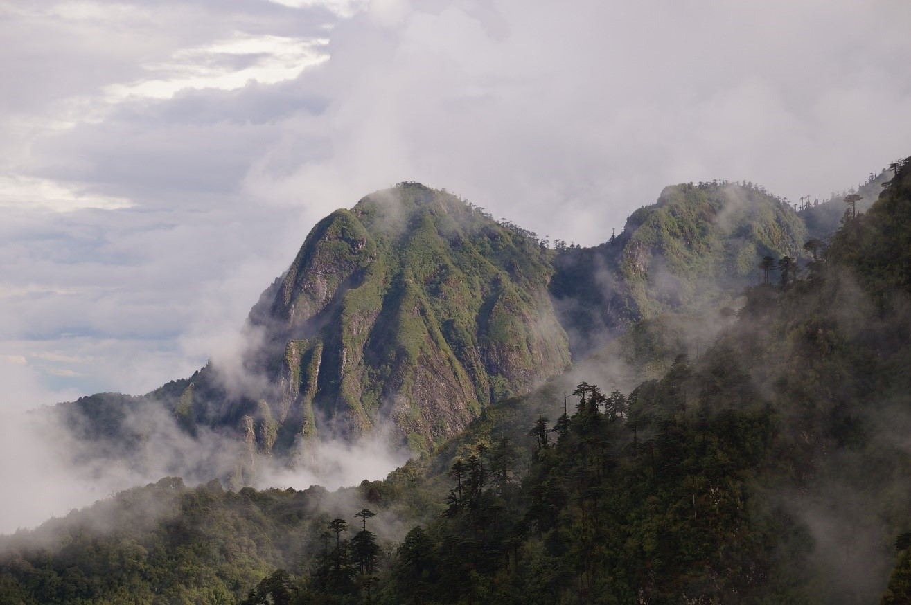
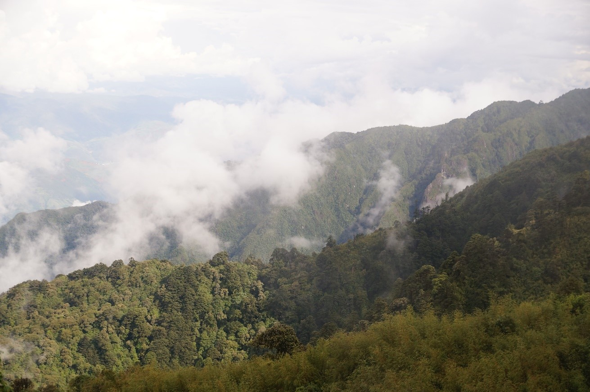
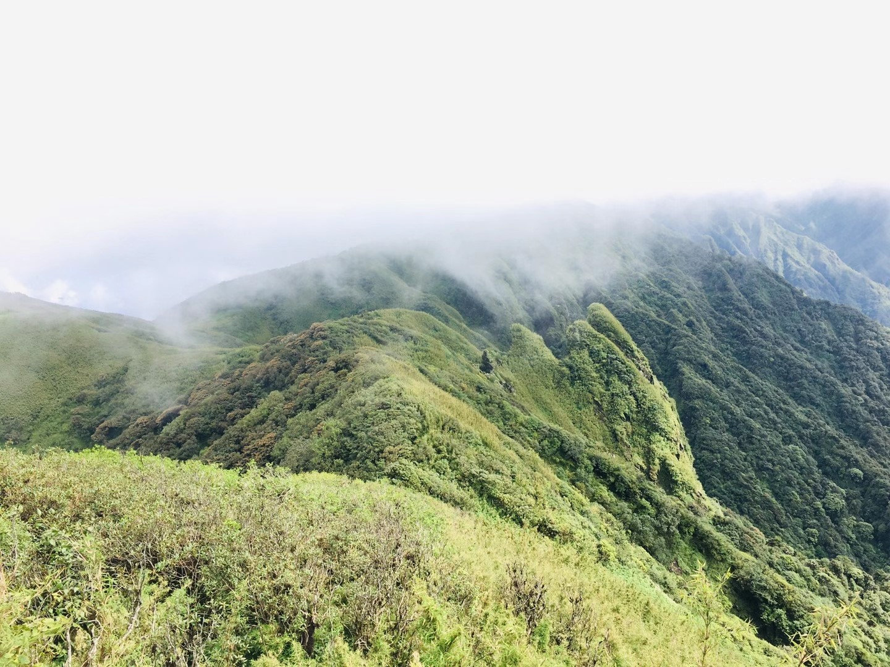
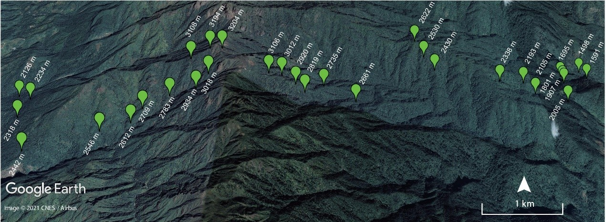
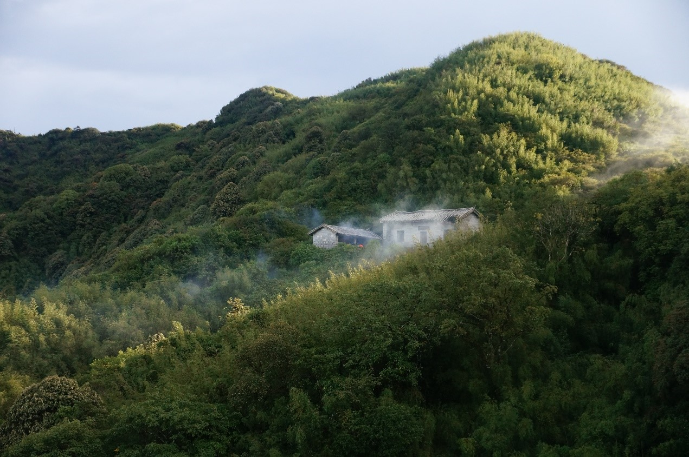
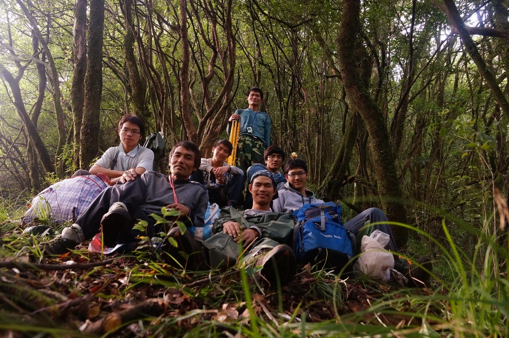
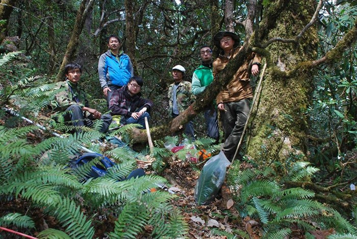
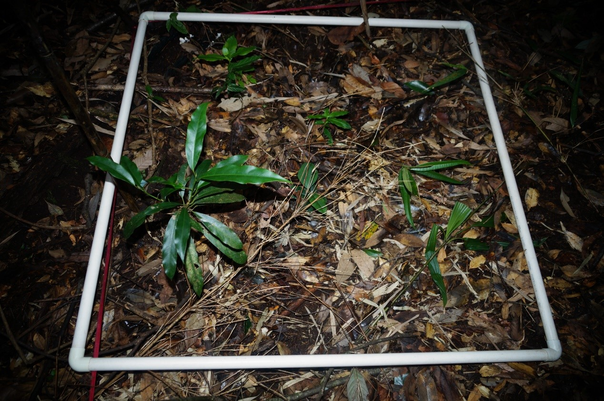

```{r setup, include=FALSE}
knitr::opts_chunk$set(echo = TRUE)
```

<br>

## Mt. Gaoligong (云南高黎贡山)

Mt. Gaoligong is located at the border between China and Myanmar, containing Tengchong County, northern part of Longling County, western part of Baoshan County, Lushui County, Fugong County, Gongshan County, and southern part of Chayu County in China and Kachin State of Burma. A majority of the mountain is located within the Mt. Gaoligong National Nature Reserve (24°40′ - 28°30′ N, 97°30′ - 99°00′ E), and has a total area of 43,949 km2. The mountain peak is at 6148 m a.s.l. This region is mainly influenced by the Indian monsoon climate, with mean annual temperature varying from 11℃ to 15℃, and annual precipitation ranging from 1667 mm to 2000 mm.

[](Pictures/Gaoligongshan-2.jpg){#id .class width=30% height=30%}

<br>

<div align="center">
```{r DT, echo=FALSE, message=FALSE, warning=FALSE}
# example: https://www.earthdatascience.org/courses/earth-analytics/get-data-using-apis/leaflet-r/
library(dplyr)
library(ggplot2)
library(rjson)
library(jsonlite)
library(leaflet)
library(RCurl)
library(openxlsx)
dat <- read.xlsx("I:\\Research\\BEST\\BEST_Documents\\Locations_Best_Current.xlsx")
dat <- dat[which(dat$Name=="Gaoligongshan"),]
best_map <- leaflet() %>%
  addProviderTiles("Esri.NatGeoWorldMap") %>%
  addCircleMarkers(color = "red", stroke = FALSE, fillOpacity = 0.5, lng=dat$long, lat=dat$lat, popup=dat$NameCN)%>%
  setView(dat$long[1], dat$lat[1], zoom = 8)
best_map
```
</div>

<hr>

### **Vegetation**

Due to the steep terrain and drastically climatic variations along elevation, Mt. Gaoligong has an obvious vertical distribution zone of vegetation. Vegetation in the Gaoligong Mountains from low to high altitudes is tropical monsoon forest (< 1000 m a.s.l.), subtropical evergreen broad‐leaf forest (1000-2600 m a.s.l.), temperate (montane) deciduous broad‐leaf forest (1000-3000 m a.s.l.), sub‐alpine coniferous forest (2700-3500 m a.s.l.), alpine meadow (> 3400 m a.s.l.), and alpine tundra.

<div align="center">

{width="15cm"}

{width="15cm"}

{width="15cm"}

</div>

<hr>

### **Flora**

The flora of Gaoligong Mountains is very rich, harboring at least 4294 seed plant species, belong to 1103 genera and 201 families. Species endemism is also high, with 434 endemic species from 205 genera in 88 families.

<hr>


### **Research sites of BEST network**

In 2012-2014, thirty-two 20 m × 50 m plots were established along elevational gradient on east (19 plots with elevation from 1480 m to 3200 m) and west slope (13 plots with elevation from 2100 m to 3200 m), respectively. The plots were set at intervals of ~100 m in elevation. Within each plot, all woody stems with ≥ 1 cm DBH were tagged and identified to species. There were 8995 individuals with DBH ≥ 1 cm recorded, belonging to 75 families, 143 genera and 316 species. Meanwhile, 189 species for shrubs and 237 herabceous species were identified in our study plot.

<div align="center">


The location of 32 long-term monitoring plots along elevation







The establishment of forest plots in Gaoligong Mountains




The investigation of shrub and herbaceous species composition

</div>

<hr>

### **Principal Investigator**

Jie Liu (刘杰): [liujie@mail.kib.ac.cn](mailto:liujie@mail.kib.ac.cn)

Yahuang Luo (罗亚皇): [luoyahuang@mail.kib.ac.cn](mailto:luoyahuang@mail.kib.ac.cn)

<hr>

### **Selected Publications**

Coming soon.

<hr>

### **Site Support**

This site has been supported by:

-   National Natural Science Foundation of China

-   Gaoligongshan National Nature Reserve

<hr>