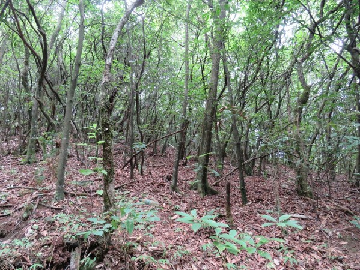
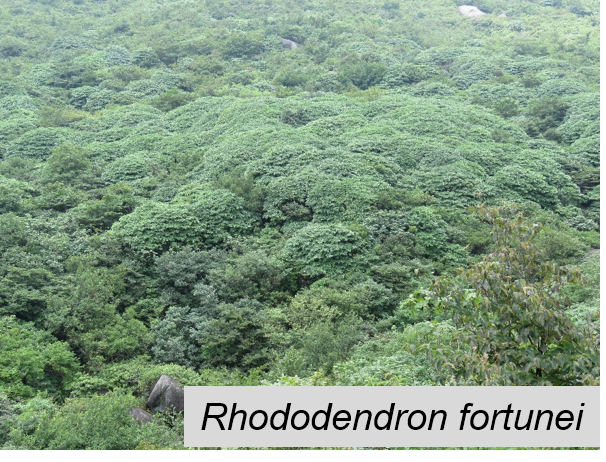
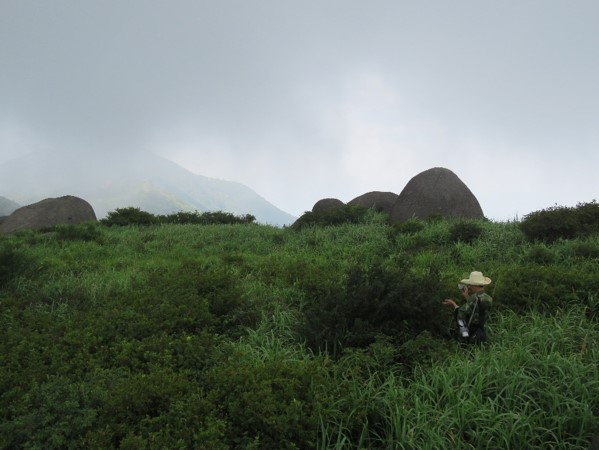
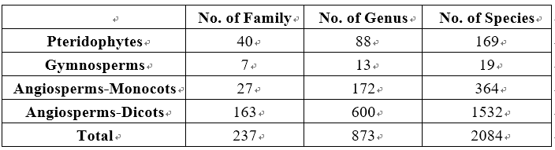
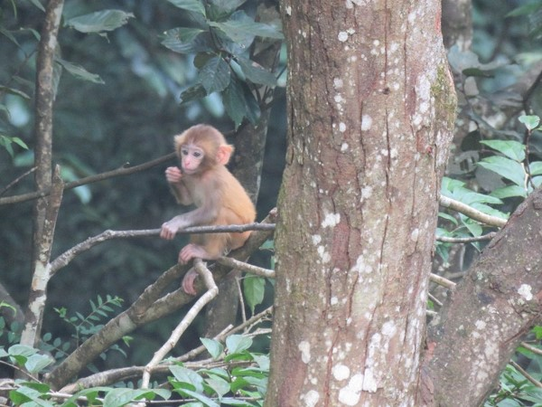
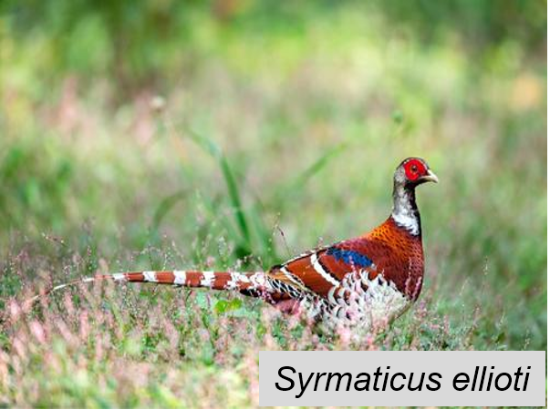
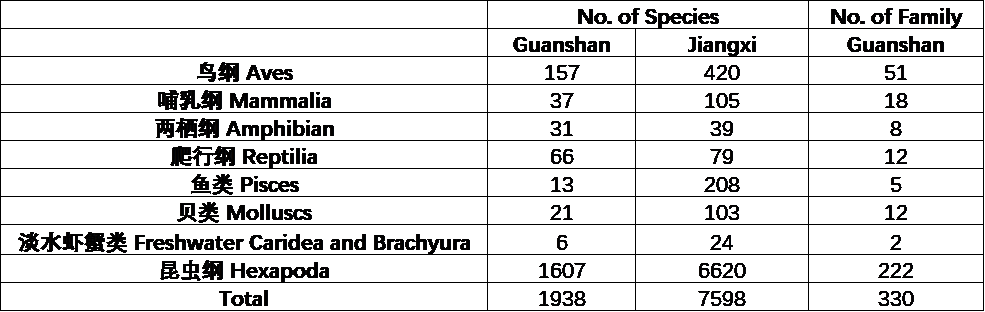
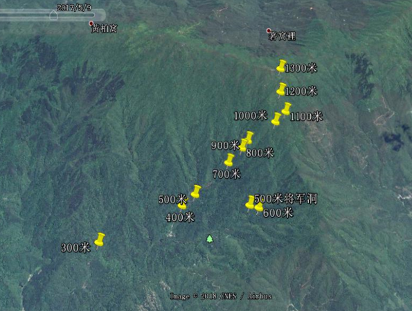
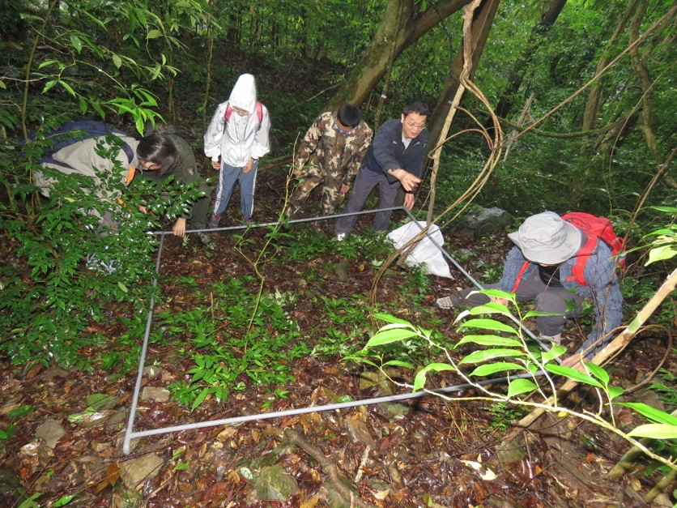

```{r setup, include=FALSE}
knitr::opts_chunk$set(echo = TRUE)
```

<br>

## Mt. Guanshan (江西官山)

Mt. Guan is located in the northwest of Jiangxi Province. A majority of the mountain is located within the Mt. Guan National Nature Reserve (28°30'-28°40'N, 114°29'-114°45'E), and has a total area of 115 km2. The mountain peak is at 1480 m a.s.l. This region is mainly influenced by the Pacific monsoon climate, with mean annual temperature 11℃ to 16.2℃, and annual precipitation ranging from 1950 mm to 2100 mm.

<div align="center">
```{r DT, echo=FALSE, message=FALSE, warning=FALSE}
# example: https://www.earthdatascience.org/courses/earth-analytics/get-data-using-apis/leaflet-r/
library(dplyr)
library(ggplot2)
library(rjson)
library(jsonlite)
library(leaflet)
library(RCurl)
library(openxlsx)
dat <- read.xlsx("I:\\Research\\BEST\\BEST_Documents\\Locations_Best_Current.xlsx")
dat <- dat[which(dat$Name=="Guanshan"),]
best_map <- leaflet() %>%
  addProviderTiles("Esri.NatGeoWorldMap") %>%
  addCircleMarkers(color = "red", stroke = FALSE, fillOpacity = 0.5, lng=dat$long, lat=dat$lat, popup=dat$NameCN)%>%
  setView(dat$long[1], dat$lat[1], zoom = 8)
best_map
```
</div>

<hr>

### **Vegetation**

Due to the steep terrain and drastically climatic variations along elevation, Mt. Guan has an obvious vertical distribution zone of vegetations, including evergreen broad-leaved forest, evergreen and deciduous broad-leaved mix forest, deciduous broad-leaved forest, coniferous forest, and scrublands.

<div align="center">
[](Pictures/Guanshan-2.jpg)

[](Pictures/Guanshan-4.png)

[](Pictures/Guanshan-5.jpg)
</div>

<hr>

### **Flora**

According to the Scientific Survey Report on the Guanshan Nature Reserve in Jiangxi Province (Edited by Liu, X.Z. and Wu, H.P. 2005), there are 2084 vascular plant species, belonging to 237 families and 873 genera. See the below table for plant richness.

[](Pictures/Guanshan-0.png)

<hr>

### **Fauna**

<div align="center">
[](Pictures/Guanshan-3.jpg)

[](Pictures/Guanshan-6.png)
</div>

The incomplete list of the Fauna of Guanshan is below.

[](Pictures/Guanshan-2.png)

Reference: Liu, X.Z. Wu, H.P. 2005. Scientific Survey and Study on the Guanshan Nature Reserve in Jiangxi Province. Chinese Forestry Press, Beijing.

<hr>

### **Research sites of BEST network**

In 2016-2018, twelve 20 m × 20 m plots along an elevational gradient were set up from 290 m to 1370 m above the sea level in this mountain. The plots were set at intervals of \~100 m in elevation. Within each plot, all woody stems with ≥ 1 cm DBH were tagged and identified to species. There were 4073 individuals with DBH ≥ 1 cm recorded, belonging to 53 families, 104 genera and 233 species.

<div align="center">
[](Pictures/Guanshan-1.png)
</div>

<br>

In 2020, four 2 m × 2 m seedling plots were set up in every elevational plot. There were 176 species recorded, belonging to 65 families and 111 genera.

[](Pictures/FieldSurvey-2.jpg){#id .class width="30%" height="30%"} <br>

<hr>

### **Principal Investigator**

Jian Zhang (张健): [jzhang@des.ecnu.edu.cn](mailto:jzhang@des.ecnu.edu.cn)

**Research Team**:

-   Prof. Jian Wang (East China Normal University)

-   Dr. Zhaochen Zhang (East China Normal University)

-   Mr. Lin Chen (Guanshan National Nature Reserve)

<hr>

### **Selected Publications**

Coming soon.

<hr>

### **Site Support**

This site has been supported by:

-   National Natural Science Foundation of China

-   Natural Science Foundation of Shanghai

-   School of Ecological and Environmental Sciences, East China Normal University

-   East China Normal University

-   Guanshan National Nature Reserve

<hr>
