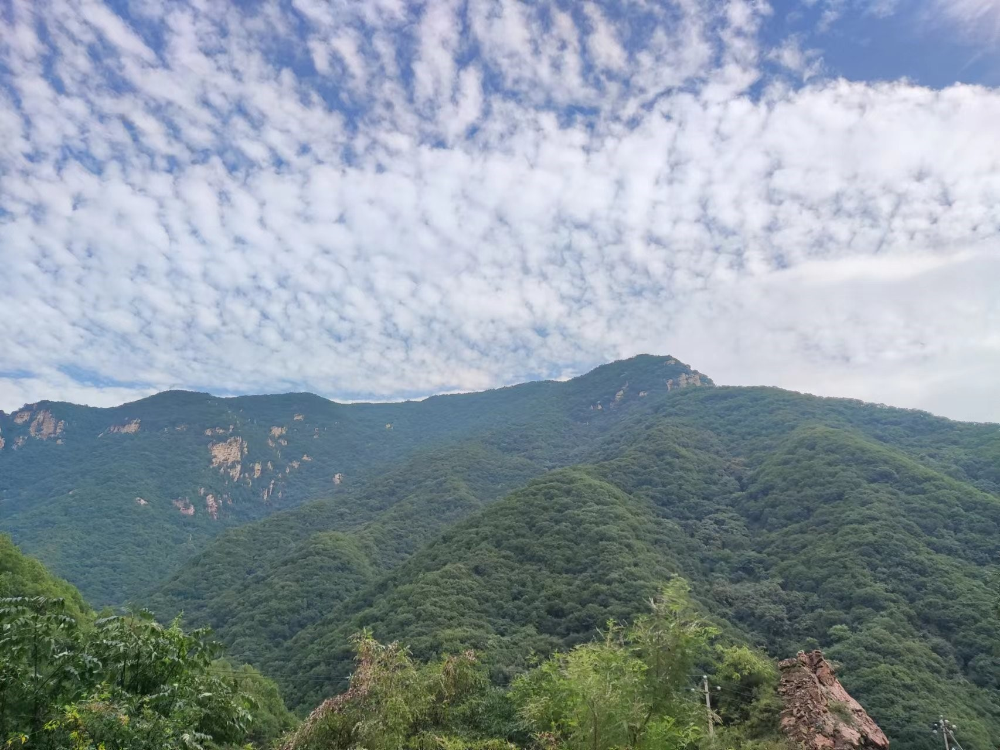
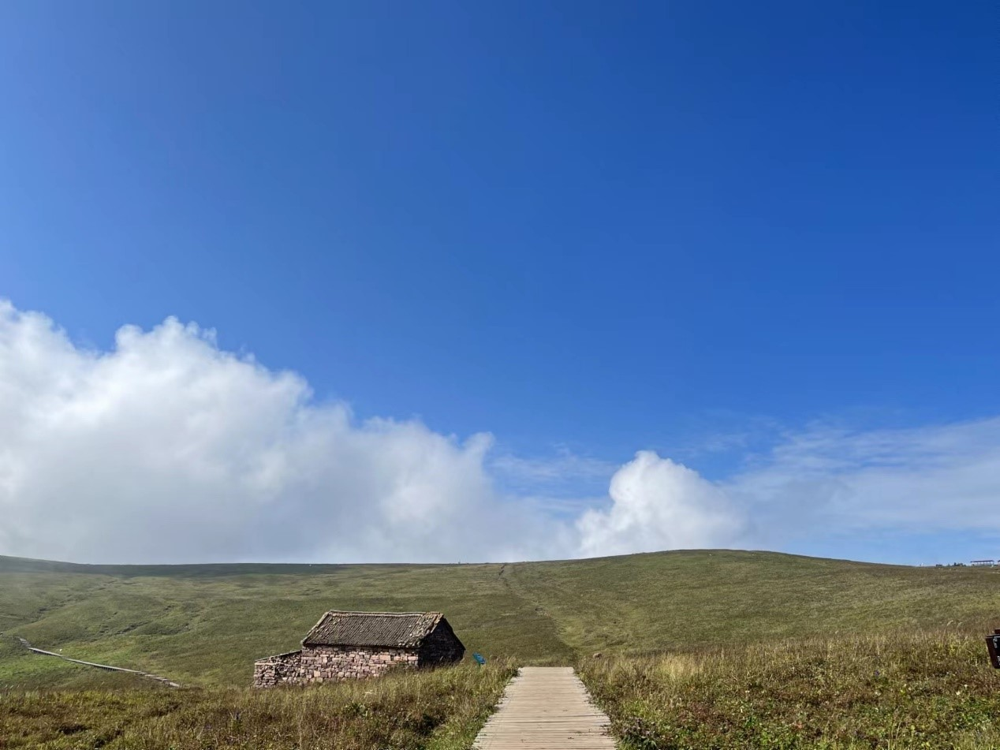
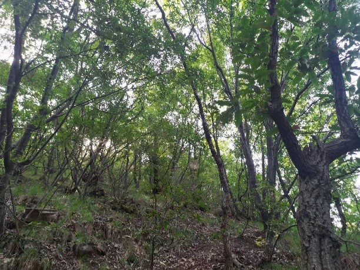
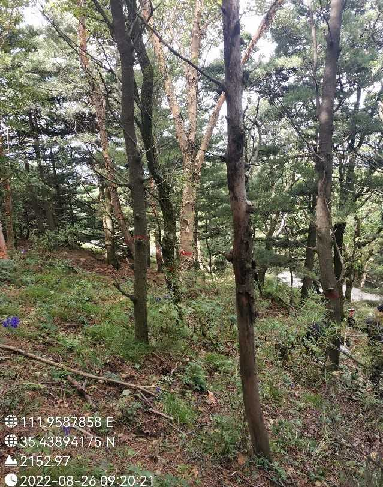
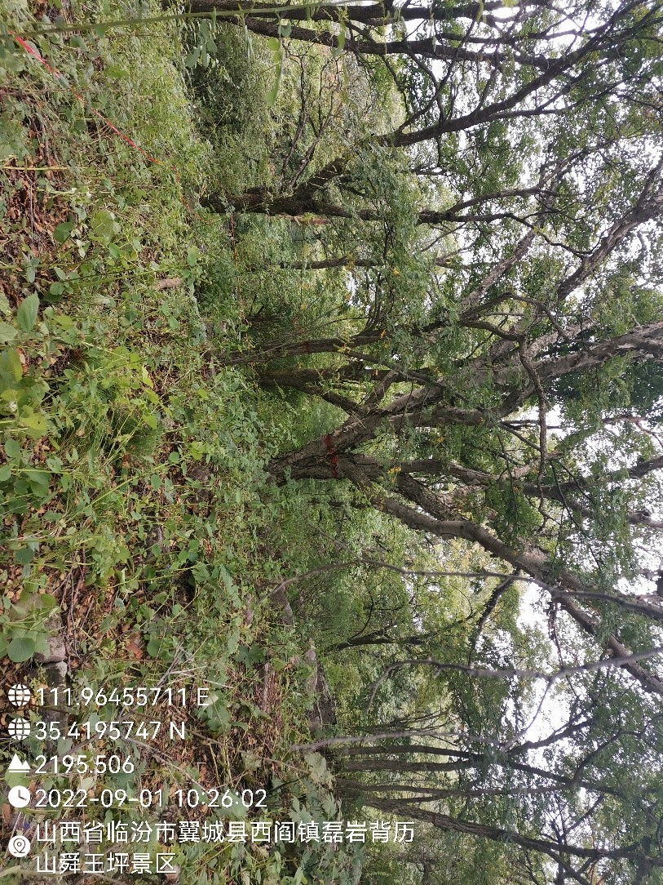
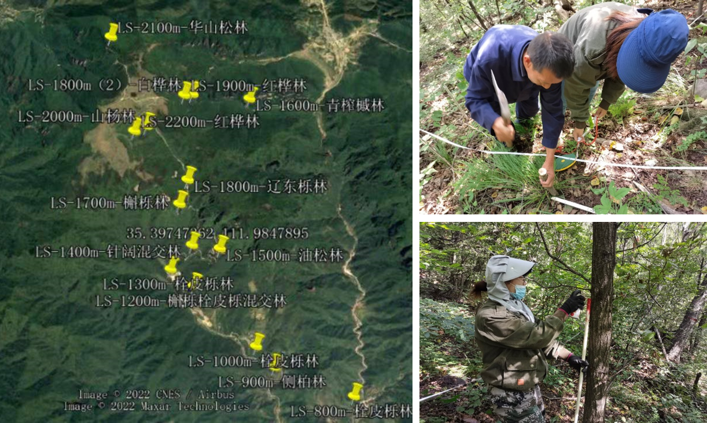

```{r setup, include=FALSE}
knitr::opts_chunk$set(echo = TRUE)
```

<br>
<br>
<br>

## Mt. Lishan (历山)

The site was conducted in Lishan National Nature Reserve (111°51′-112°5′E; 35°16′-35°27′N), located at the southern Zhongtiao Mountains in Shanxi province, China. The mountain peak is at 2,358 m a.s.l. The region is characterized by a warm temperate continental monsoon, with mean annual temperature of 13.3°C and extreme high temperatures of 26.1℃ recorded in July. The mean annual precipitation is 667.6 mm, ranging from 600 to 800 mm.

[](Pictures/Lishan-1.jpg){#id .class width=30% height=30%}

[](Pictures/Lishan-2.jpg){#id .class width=30% height=30%}

<div align="center">
```{r DT, echo=FALSE, message=FALSE, warning=FALSE}
# example: https://www.earthdatascience.org/courses/earth-analytics/get-data-using-apis/leaflet-r/
library(dplyr)
library(ggplot2)
library(rjson)
library(jsonlite)
library(leaflet)
library(RCurl)
library(openxlsx)
dat <- read.xlsx("I:\\Research\\BEST\\BEST_Documents\\Locations_Best_Current.xlsx")
dat <- dat[which(dat$Name=="Lishan"),]
best_map <- leaflet() %>%
  addProviderTiles("Esri.NatGeoWorldMap") %>%
  addCircleMarkers(color = "red", stroke = FALSE, fillOpacity = 0.5, lng=dat$long, lat=dat$lat, popup=dat$Name2)%>%
  setView(dat$long[1], dat$lat[1], zoom = 8)
best_map
```
</div>

<hr>

### **Vegetation, Flora and Fauna**

This region is in the transition from the subtropical zone to the warm temperate zone, and as the northern margins of many subtropical species’ natural distribution, such as *Cercidiphyllum japonicum*, *Sinowilsonia henryi*, *Rhododendron micranthum*, etc. This reserve has a forest coverage of 90.7% and warm-temperate deciduous broadleaved forest as the typical zonal vegetation. Five distinct vegetation types were observed along elevations in our region. Prairie shrubland (800–1200 m), coniferous and broad-leaved mixed forests (1200-1800 m), deciduous broadleaved forests (1500-2000 m), mountainous deciduous broadleaved forests (2000-2200 m), and subalpine meadow (2000-2358 m).

According to the historical reports, there are 99 moss species in 70 genera of 34 families; 59 fern species in 27 genera of 16 families; and 1272 seed plant species in 512 genera of 112 families, including 8 gymnosperms species in 5 genera of 4 families and 1264 angiosperms species in 507 genera of 108 families.

According to the historical reports, there are 380 wild animals in 230 genera of 92 families. Among them, 48 mammals species in 46 genera of 18 families; 13 amphibian species in 11 genera of 6 families; 25 reptile species in 18 genera of 7 families; 294 bird species in 155 genera of 61 families.

<div align="center">

[](Pictures/Lishan-3.jpg){#id .class width=30% height=30%}

Deciduous broadleaved forests 


[](Pictures/Lishan-4.jpg){#id .class width=30% height=30%}

Coniferous and broad-leaved mixed forests


[](Pictures/Lishan-5.jpg){#id .class width=30% height=30%}

Mountainous deciduous broadleaved forests
<br>

<hr>


### **Research sites of BEST network**

In 2022, fifteen 20 m × 20 m plots along an elevational gradient were set up, spanning 1,325 m in elevation from 894 to 2,219 m above sea level (asl) in this mountain. The plots were set at intervals of ~100 m in elevation. Within each plot, all woody stems with ≥ 1 cm DBH were tagged and identified to species. There were 2045 individuals with DBH ≥ 1 cm recorded, belonging to 22 families, 44 genera and 61 species.

<div align="center">
[](Pictures/Lishan-6.png){#id .class width=30% height=30%}
<br>

<hr>

### **Principal Investigator**

Houjuan Song (宋厚娟): [songhoujuan@163.com](mailto:songhoujuan@163.com)


**Research Team**:

-  Xiuqing Yang (Shanxi Agricultural University)
-  Xin Wang (Shanxi Vocational University of Engineering Science and Technology)


<hr>

### **Selected Publications**

Will update soon.

<hr>

### **Site Support**

This site has been supported by:

-   Science Foundation for Youths of Shanxi Province 
-   College of Forestry, Shanxi Agricultural University
-   Lishan National Natural Reserve

<hr>