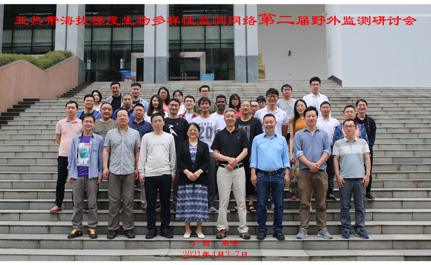
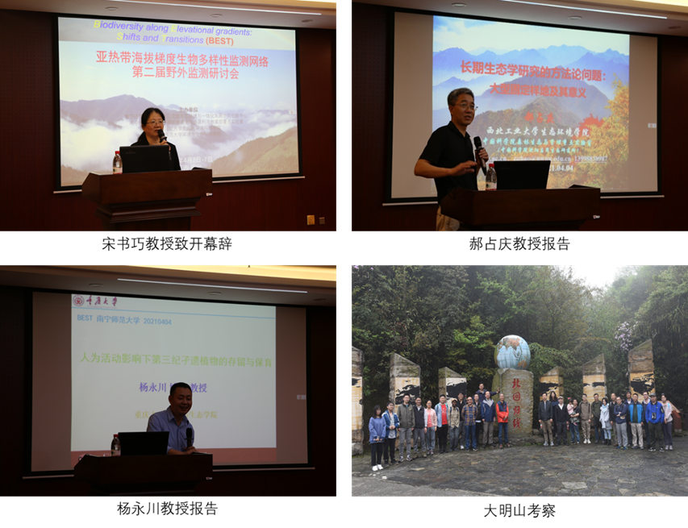

```{r setup, include=FALSE}
knitr::opts_chunk$set(echo = TRUE)
```

<br>

<div align="center">
## BEST网络第二届野外监测研讨会在南宁师范大学召开
</div>
<br>

【新闻稿来源：<https://hjsmxy.nnnu.edu.cn/info/1041/2231.htm>】


&emsp;&emsp;2021年4月3-7日，由南宁师范大学广西西江流域生态环境与一体化发展协同创新中心、南宁师范大学北部湾环境演变与资源利用教育部重点实验室、华东师范大学生态与环境科学学院、南宁师范大学环境与生命科学学院等单位共同举办的亚热带海拔梯度生物多样性监测网络第二届野外监测研讨会在我校召开。来自华东师范大学、西北工业大学、重庆大学、中国科学院昆明植物研究所、中国科学院动物研究所、中国科学院西双版纳植物园、福建农林大学、广西大学等14个单位40余名专家学者和研究生参加了本次研讨会。



&emsp;&emsp;南宁师范大学环境与生命科学学院院长宋书巧教授为本次研讨会致辞，会议特邀西北工业大学郝占庆教授和重庆大学杨永川教授作学术报告，报告题目分别为：长期生态学研究的方法论问题：大型固定样地及其意义、第三纪孓遗植物的存留及有效保育。郝占庆教授结合自身主持建立的长白山和秦岭大型固定森林样地的经验，系统阐述了生态学研究的基本方法、理论和假说以及新技术应用。杨永川教授以水杉、金钱松和银杉等孑遗植物的存留为例，介绍了人类活动对孑遗植物保育的"双重效应"，探索孑遗植物的有效保护措施。特邀报告结束后，研讨会以中国亚热带海拔梯度生物多样性监测技术交流为主线，围绕昆虫、土壤动物、鸟类、微气候、年轮、凋落物分解等生态监测技术展开讨论。与会学者积极研讨，现场气氛热烈。会后，参会学者前往大明山国家级自然保护区进行生物多样性考察。



&emsp;&emsp;生物多样性监测是生态学研究、物种保护管理和资源可持续利用的核心环节，是评估生物多样性保护进展的有效途径。本次研讨会对推动我国亚热带海拔梯度生物多样性监测网络的发展，对建立山地生物多样性监测数据平台以及开展相关科研工作等具有重要意义。
