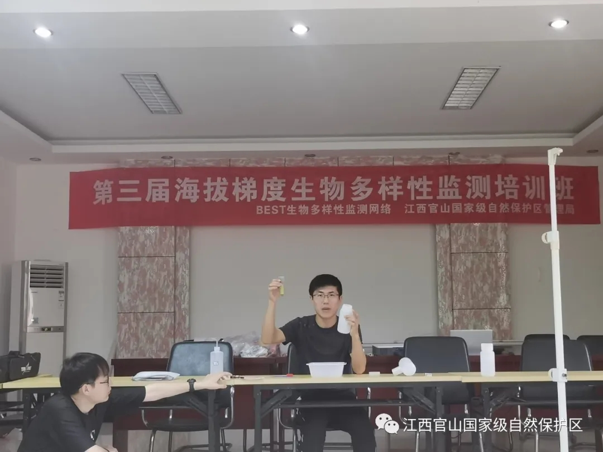

```{r setup, include=FALSE}
knitr::opts_chunk$set(echo = TRUE)
```

<br>
<div align="center">
## **BEST网络第三届野外监测研讨会在江西官山国家级自然保护区召开**
</div>

【新闻稿来源：<https://mp.weixin.qq.com/s/EPpN0fjZ2Z1cf4tIQwdzig>】


&emsp;&emsp;&emsp;&emsp;2021年5月15日至16日，华东师范大学和江西官山国家级自然保护区管理局共同举办了第三届海拔梯度生物多样性监测培训会。来自华东师范大学、福建农林大学、宁波大学、复旦大学等4所高校的11位专家学者出席会议。

<div align="center">



(马氏网安装与昆虫收集、土壤动物采样、凋落物分解实验等室内演示 彭巧华/摄)
</div>

&emsp;&emsp;会议期间开展了马氏网安装与昆虫收集、土壤动物采样、凋落物分解实验等室内演示和野外实战培训。官山保护区局领导和科研技术骨干共20人参加了培训活动。

<div align="center">


（野外实战培训 彭巧华/摄）


</div>
