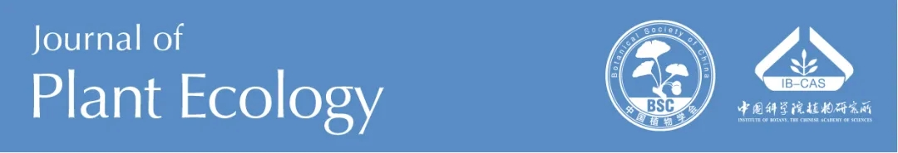
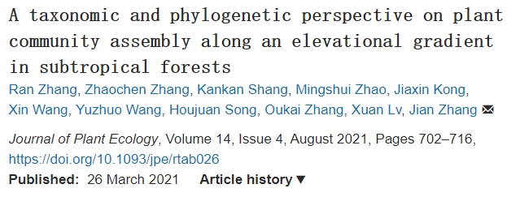

```{r setup, include=FALSE}
knitr::opts_chunk$set(echo = TRUE)
```

<br>

<div align="center">
### 【论文发表】浙江天目山木本植物群落沿海拔梯度的物种与系统发育多样性

<br>




【新闻稿来源：https://mp.weixin.qq.com/s/5rEY8N53x8qqp9H8_XeTVA】


</div>


### 中文摘要
&emsp;&emsp;生物多样性沿海拔梯度的分布格局已受到广泛关注。然而，生物多样性格局沿海拔梯度的变异及其潜在机制尚不清楚。整合生物多样性的多维度信息为理解群落构建机制提供了新思路。本研究在我国东部亚热带森林沿海拔270–1470 m的梯度上设置了17个木本植物固定样地，分析了沿海拔梯度植物群落 构建的生态和进化驱动力。基于样地内物种出现(0–1数据)和多度信息，计算群落内被子植物的物种和系统发育alpha和beta多样性、系统发育结构等，并量化多样性指标与微气候和地形之间的关系。研究发现，不论多度加权与否，物种alpha多样性均沿海拔升高而增加，物种和系统发育的相似性随海拔距离的增加而呈衰减趋势。然而，多度加权与否会形成不同的系统发育alpha多样性格局。对于系统发育结构而言，沿海拔增加并无明显趋势。地形和微气候是多样性格局和系统发育结构的主要驱动力。与未考虑物种多度的多样性指标相比，多度加权的指标与坡度和胸高断面积相关性更高。这些结果表明，由局域物种多度介导的确定性过程对沿海拔梯度的植物群落构建具有一定影响。

### Citation：
Zhang R, Zhang Z, Shang K, et al. (2021) A taxonomic and phylogenetic perspective on plant community assembly along an elevational gradient in subtropical forests. J Plant Ecol 14:702–716.

### 原文链接：
https://doi.org/10.1093/jpe/rtab026
