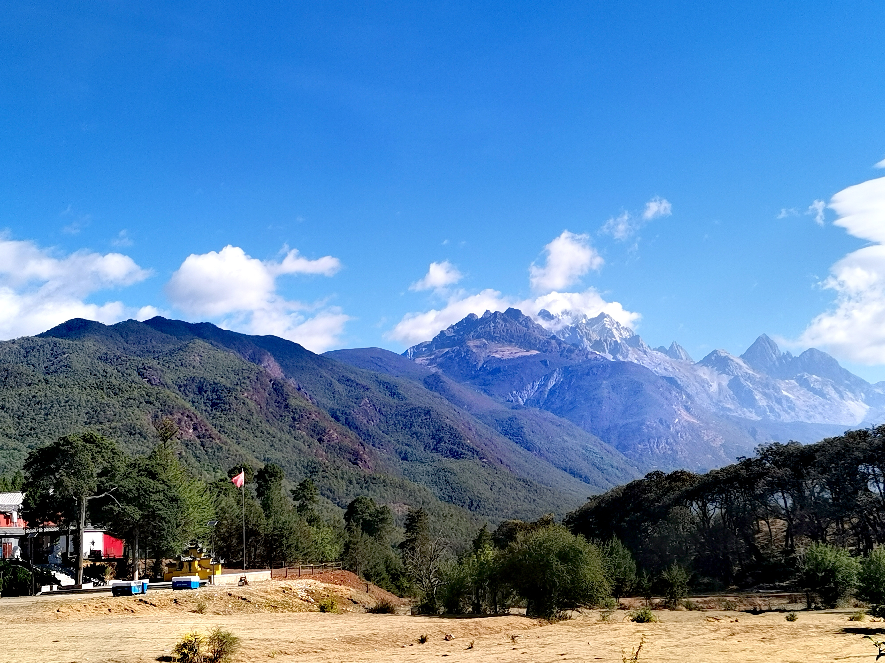
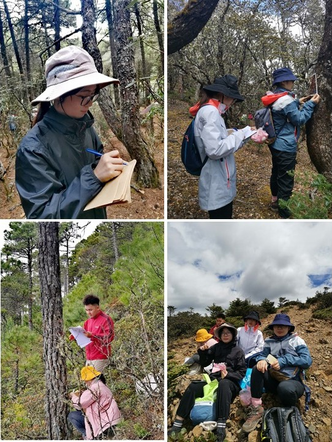
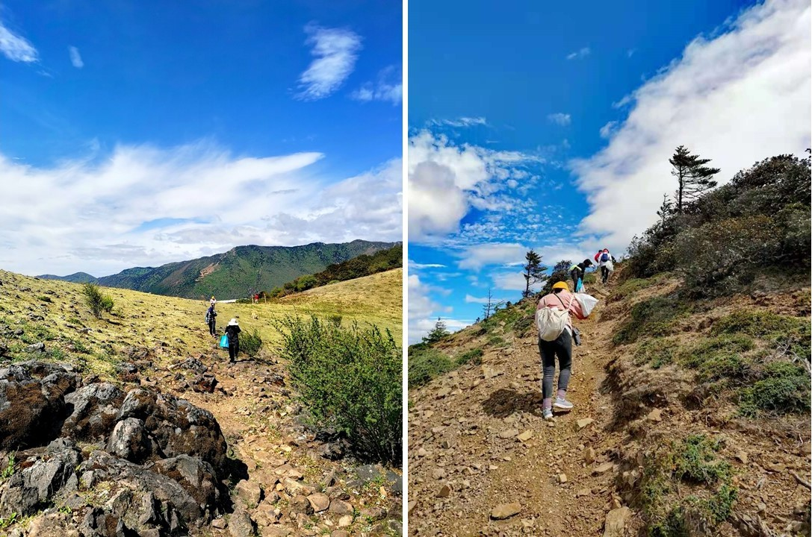

```{r setup, include=FALSE}
knitr::opts_chunk$set(echo = TRUE)
```

<br>

<div align="center">
### 云南玉龙雪山苔藓植物多样性海拔梯度调查（2021年5月30日-6月2日）
</div>

<br>
&emsp;&emsp;玉龙雪山地处云南省西北部云贵高原与青藏高原的连接部位，主峰扇子陡海拔5596米，内有北半球距赤道最近的现代海洋性冰川，保留有完整的原始森林群落和珍稀野生动植物，被誉为"冰川博物馆"和"动植物宝库"，是我国生物多样性最丰富的地区，拥有丰富的生物资源。自19世纪中叶以来，已有众多国内外植物学家到玉龙雪山进行植物调查和标本采集工作，但对该地区苔藓植物的调查和研究仍比较缺乏。

<div align="center">

玉龙雪山
</div>

&emsp;&emsp;苔藓植物是一类对环境极为敏感的原始高等植物，全世界有23000余种，是自然界的拓荒者之一。作为生物多样性中的重要类群，苔藓植物在森林生物多样性的形成和维持、生态系统的物质和能量循环等方面均具有重要的意义。同时，作为一类对外界环境及气候变化极为敏感的类群，苔藓植物的保护应引起重视，而摸清其多样性家底及空间分布规律是开展对其保护的重要前提。

<div align="center">

玉龙雪山高山苔藓林
</div>

&emsp;&emsp;为了解玉龙雪山苔藓植物多样性本底资源及沿海拔梯度分布规律，华东师范大学苔藓植物研究团队近期联合上海科技馆和贵州师范大学相关专家，于2021年5月30日至6月2日对玉龙雪山进行了苔藓植物调查和标本采集工作，本次调查覆盖了海拔2600～3800 m内的18个20 m × 50 m 样地，采用微样方调查法（SPS）对样地内的树附生苔藓植物丰富度和盖度进行了调查和统计，同时采用区系生境调查法（FHS）对样地内树附生、岩面薄土、土生、石生、朽木生等各种生境进行了全面的普查。共获得苔藓植物标本2218份，其中苔类植物627份，藓类植物1591份，这些标本后期将按科属进行分类，并由各个类群分类专家协助并完成鉴定。本次调查也得到中国科学院昆明植物研究所的罗亚皇老师及丽江高等师范专科学校师生的鼎力相助。

<div align="center">


野外工作



高海拔作业


微笑面对高反


与丽江师专师生一起工作


高海拔景观


顺利完成工作

</div>