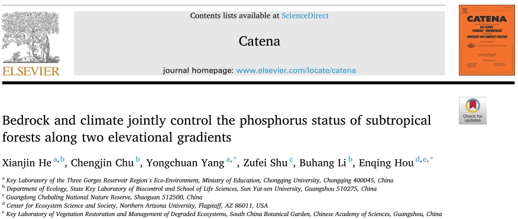
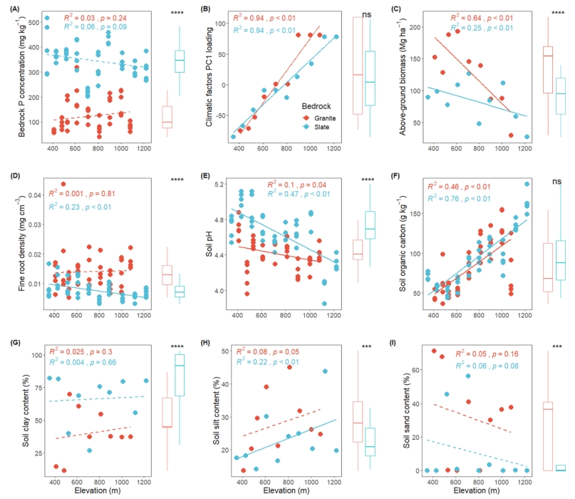
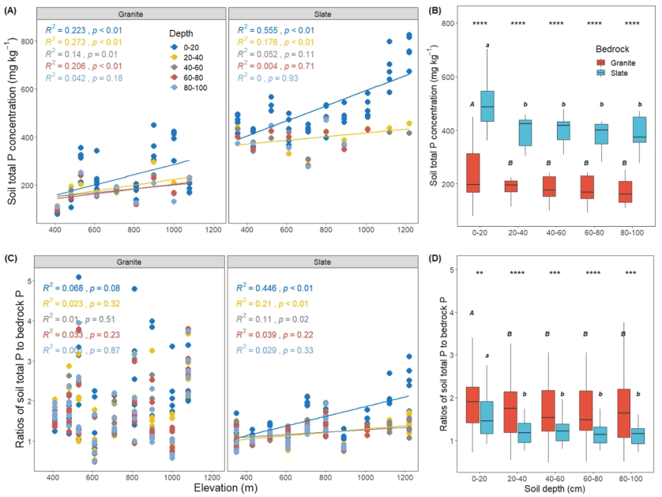
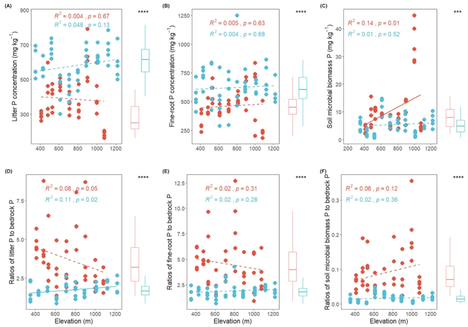

```{r setup, include=FALSE}
knitr::opts_chunk$set(echo = TRUE)
```

<br>

<div align="center">
### 重庆大学何先进等在Catena上发表母岩和气候共同影响森林土壤生态系统磷循环的论文
</div>

<br>
转自：https://mp.weixin.qq.com/s/Gl9_faLS29bgwjPGLz9jhg

原文链接：https://www.sciencedirect.com/science/article/pii/S0341816221003830

### BEST山地：广东车八岭
<br>

<div align="center">

</div>

&emsp;&emsp;重庆大学杨永川教授团队在Catena上发表题为 “Bedrock and climate jointly control the phosphorus status of subtropical forests along two elevational gradients” 的文章。该研究以亚热带两条母岩分别为花岗岩和板岩的海拔梯度样带为研究对象，揭示了气候梯度和母岩类型对森林土壤生态系统磷循环的共同作用。团队成员何先进博士为论文第一作者。该研究主要实验内容为何先进博士在中山大学储诚进教授实验室工作期间完成；论文写作在杨永川教授指导下完成。

&emsp;&emsp;陆地生态系统固持碳的能力，普遍受到养分元素——磷供给的限制。气候和母岩是影响土壤磷供给的两个重要因素。已有大量研究关注气候或母岩如何独立地影响土壤磷循环，但是这两个因素是否还可能交互地影响土壤磷循环，即不同母岩上生态系统磷循环对气候梯度的响应是否不一样，目前尚不清楚。

&emsp;&emsp;随着海拔上升，存在典型的气候变化梯度。这使海拔梯度样带成为研究生态系统如何响应气候梯度的天然实验室。本研究在广东省车八岭国家级自然保护区设置了两条母岩分别是花岗岩和板岩的海拔梯度样带，研究了土壤生态系统的磷循环状态及过程。


研究结果表明：

（1）花岗岩的磷含量显著低于板岩。相应地，花岗岩样带上矿质土壤、凋落物、植物细根的磷含量也显著低于在板岩样带上的。与绝对含量不同的是，这些生态系统组分（即矿质土壤、凋落物、细根）磷含量与母岩磷含量的比值，则是在花岗岩样带现在高于板岩样带。同时，低磷样带上表现出更强的磷上吸现象 (nutrient uplift)。

（2）虽然母岩磷含量没有显著的海拔梯度格局，但表层土壤总磷、易分解有机磷和无机磷含量，在两条样带都表现出随海拔上升而显著增加的趋势。土壤中等程度易分解有机磷在两条样带呈现相反的海拔梯度格局，这表明母岩磷含量与气候梯度对此土壤磷组分具有交互作用。多元线性回归分析，也进一步印证了此结果。

（3）相关分析结果显示，在低磷样带，植物和土壤不同组分的磷含量呈现更为紧密的相关性。这可能是由于低磷生态系统磷循环处于相对“闭合”的状态 (recycling systems)；而磷含量较高的生态系统，磷循环则更为“开放” (acquiring systems)。

&emsp;&emsp;以上结果表明，母岩磷含量是亚热带森林生态系统磷含量最主要的控制因子，同时母岩与气候的交互作用也是不能忽视影响因素。本研究表明，整合局域尺度上母岩特征，将有助于提高模型预测生态系统磷循环过程的精确度。

<div align="center">


图1 两条海拔梯度样带上母岩磷含量、气候、植物及土壤理化性质沿海拔的变化趋势。
<br>


图2 不同深度矿质土壤总磷及其与母岩磷含量比值的海拔梯度格局。
<br>


图3 两种母岩上土壤Hedley磷组分沿海拔梯度的变化趋势。
</div>

