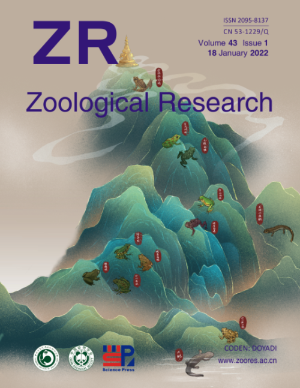
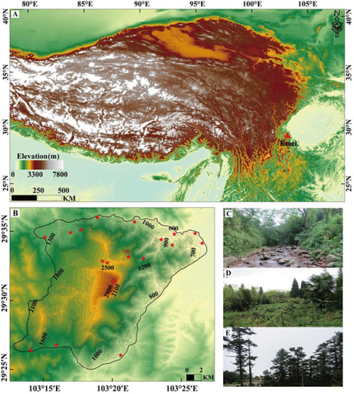
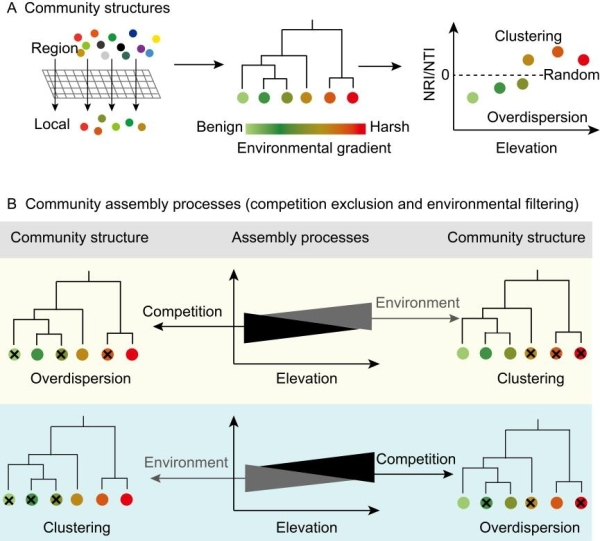

```{r setup, include=FALSE}
knitr::opts_chunk$set(echo = TRUE)
```

<br>

<div align="center">
## 封面论文 | 成都生物所等揭示峨眉山两栖动物多样性的海拔梯度格局与群落构建机制
</div>
<br>

【新闻稿来源：<https://www.cas.cn/syky/202112/t20211231_4820483.shtml>; <https://m.chinanews.com/wap/detail/chs/zw/9645604.shtml>】

探索生物多样性的空间格局及其沿地理梯度的内在驱动机制是生态学、生物地理学和保护生物学的重要科学问题之一。其中，物种共存和群落构建机制是研究热点与难点。近年来，随着功能多样性与系统发育多样性研究的兴起与发展，通过整合物种多样性、物种在生态系统中的功能及其系统发育关系来探讨物种共存和群落构建机制，可更好地为生物多样性研究与保护提供新的视角和思路。

　　山地系统孕育了进化上独特且极为丰富的生物多样性，对两栖动物来说尤其如此。然而，当前多数山地系统中两栖动物沿海拔梯度的多样性格局及群落构建机制尚不清楚。峨眉山位于多种自然要素的交汇地区，拥有特殊的地理位置和独特的气候条件，这使峨眉山的深壑峭壁成为诸多动植物的避难所和栖息地；峨眉山丰富的生物多样性及较大的海拔跨度（2600 m），为理解两栖动物的海拔梯度格局提供了理想的研究平台。

　　为深化对峨眉山生物多样性的认识，中国科学院成都生物研究所研究员胡军华团队基于翔实的两栖动物野外群落调查，辅以文献资料、标本馆馆藏记录等，解析了峨眉山两栖动物系统发育和功能多样性沿海拔梯度的分布格局及群落结构，并进一步评估了空间（面积）和环境因子（温度、降水、太阳辐射、归一化植被指数和潜在蒸发量）在不同维度两栖动物多样性及群落构建中的重要性。结果表明，峨眉山两栖动物系统发育和功能多样性沿海拔均呈单峰分布；控制物种数的影响后，它们的标准化效应值随海拔升高单调递增。系统发育净亲缘指数、最近亲缘指数及功能净亲缘指数均沿海拔呈现出由正转负的趋势，这表明群落结构经历了由聚集到发散的转变，并暗示构建机制可能存在由环境过滤到竞争排斥的变化。该研究阐明了环境过滤和竞争排斥在亚热带山地系统两栖动物群落构建中的重要性：随着海拔升高，两者的主导作用可能会发生转换。通过整合不同维度的生物多样性，该研究有助于阐释山地系统两栖动物的群落构建机制。

　　近日，相关研究成果以Multidimensional amphibian diversity and community structure along a 2 600 m elevational gradient on the eastern margin of the Qinghai-Tibetan Plateau为题，作为封面文章，发表在Zoological Research上。研究工作得到国家自然科学基金等的资助。华东师范大学科研人员参与研究。

<div align="center">


图1.Zoological Research封面：峨眉山的两栖动物




　　图2.峨眉山位置及区域内海拔、主要植被类型状况




　　图3.基于群落结构推断其构建机制（环境过滤vs.竞争排斥）的理论框架图
</div>
<br>

