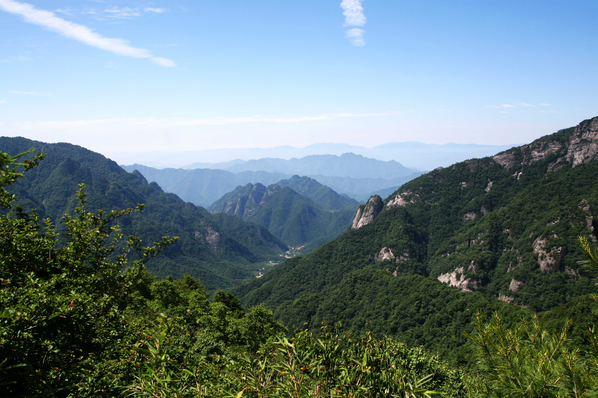
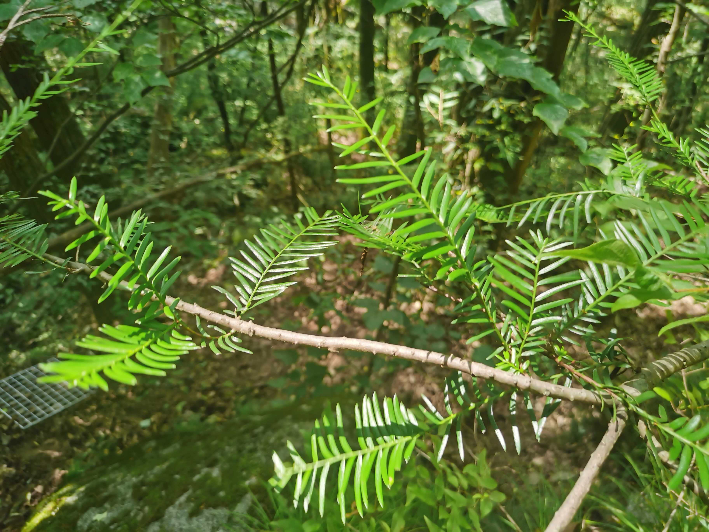
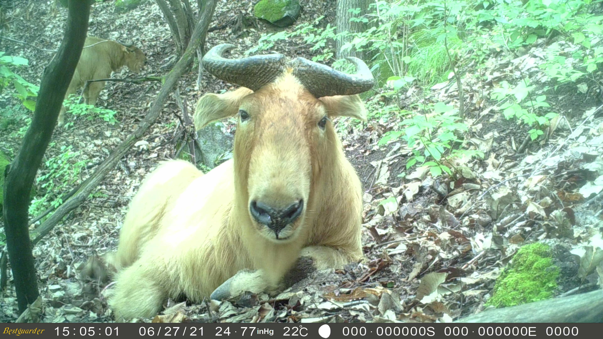
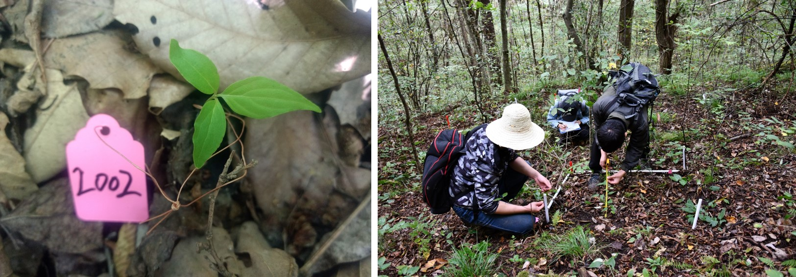
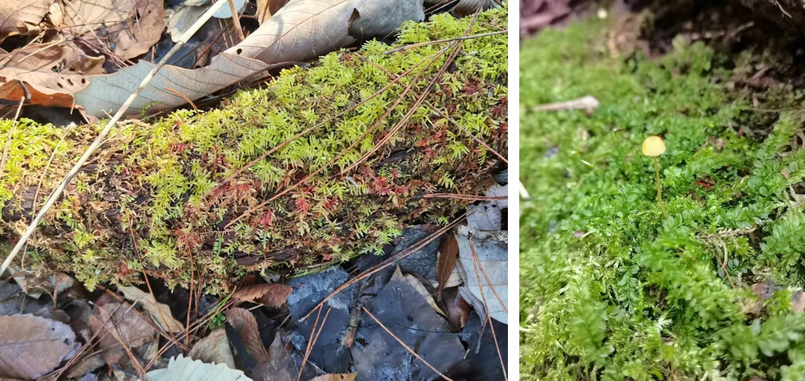

```{r setup, include=FALSE}
knitr::opts_chunk$set(echo = TRUE)
```

<br>
<br>
<br>

## Mt. Qinling (秦岭)

The Qinling Mountains, are a major east–west mountain range mainly in southern Shaanxi Province, China. The Qinling Mountains provide a natural geographical boundary between South and North China. The highest mountain is Mount Taibai at 3767 m a. s. l. The climate is transitional from subtropical to temperate, with annual precipitation at about 850 to 950 mm.

[](Pictures/Qinling-1.jpg){#id .class width=30% height=30%}

<div align="center">
```{r DT, echo=FALSE, message=FALSE, warning=FALSE}
# example: https://www.earthdatascience.org/courses/earth-analytics/get-data-using-apis/leaflet-r/
library(dplyr)
library(ggplot2)
library(rjson)
library(jsonlite)
library(leaflet)
library(RCurl)
library(openxlsx)
dat <- read.xlsx("I:\\Research\\BEST\\BEST_Documents\\Locations_Best_Current.xlsx")
dat <- dat[which(dat$Name=="Qinling"),]
best_map <- leaflet() %>%
  addProviderTiles("Esri.NatGeoWorldMap") %>%
  addCircleMarkers(color = "red", stroke = FALSE, fillOpacity = 0.5, lng=dat$long, lat=dat$lat, popup=dat$Name2)%>%
  setView(dat$long[1], dat$lat[1], zoom = 8)
best_map
```
</div>

<hr>

### **Vegetation and Flora**

The vegetations show an obvious vertical distribution zone, including deciduous broad-leaved forest, coniferous and broad-leaved mixed forest, dark coniferous forest, bright coniferous forest and alpine shrub meadow.

There are 3800 plant species and 2,931 of them are seed plants, accounting for 12% of the total number of seed plants in China. Five plant species, including Chinese yew (*Taxus chinensis*) and Chinese dove tree (*Davidia Involucrata*), belong to Class I national protected plant species and 45 belongs to Class II national protected plant species (Zhao et al., 2020. Journal of Geographical Sciences: 30(4):642-656).

<div align="center">
[](Pictures/Qinling-2.jpg){#id .class width=30% height=30%}

*Taxus wallichiana var. chinensis*
<br>

<hr>

### **Fauna**

According to investigations, so far, about 587 wild animal species have been found on Qinling Mountains, including flagship species, such as, giant panda, takin, Sichuan snub-nosed monkey, red panda, and clouded leopard.

<div align="center">
[](Pictures/Qinling-3.jpg){#id .class width=30% height=30%}

[](Pictures/Qinling-4.jpg){#id .class width=30% height=30%}

Takin and Sichuan snub-nosed monkey observed by infrared cameras

<hr>

### **Research sites of BEST network**

<div align="center">
[](Pictures/Qinling-5.jpg){#id .class width=30% height=30%}

Tree seedling survey in the plots

[](Pictures/Qinling-6.jpg){#id .class width=30% height=30%}

Bryophytes survey in the plots
<br>

<hr>

### **Principal Investigator**

Zhanqing Hao (郝占庆): [zqhao@nwpu.edu.cn](mailto:zqhao@nwpu.edu.cn)

Shihong Jia (贾仕宏): [shihong.jia@nwpu.edu.cn](mailto:shihong.jia@nwpu.edu.cn)

**Research Team**:

-   Dr. Zuoqiang Yuan (Northwestern Polytechnical University)

-   Dr. Qiulong Yin (Northwestern Polytechnical University)

<hr>

### **Selected Publications**

Will update soon.

<hr>

### **Site Support**

This site has been supported by:

-   National Natural Science Foundation of China
-   School of Ecology and Environment, Northwest Polytechnical University

<hr>