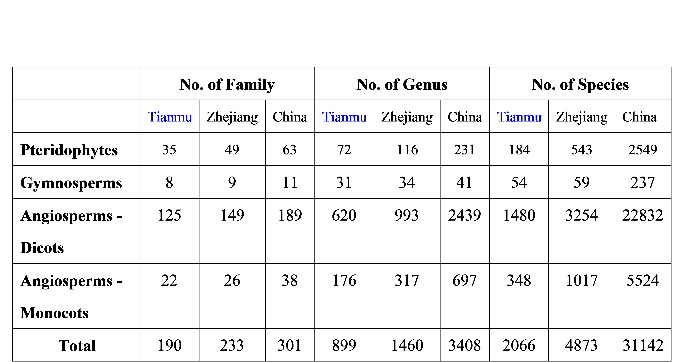

```{r setup, include=FALSE}
knitr::opts_chunk$set(echo = TRUE)
```

<br>

## Tianmushan (浙江天目山)

Mt. Tianmu is located in the northwest of Zhejiang province, China. A majority of the mountain is located within the Mt. Tianmu National Nature Reserve (30°18'30"-30°21'37"N, 119°24'11"-119°27'11"E), and has a total area of 42.84 km^2^~.~ The mountain peak is at 1506 m a.s.l. This region is mainly influenced by the Pacific monsoon climate, with mean annual temperature varying from 8.8℃ to 14.8℃, and annual precipitation ranging from 1390 mm to 1870 mm.

<div align="center">
[{width="20cm"}](Pictures/Tianmu1.jpg)

```{r DT, echo=FALSE, message=FALSE, warning=FALSE}
# example: https://www.earthdatascience.org/courses/earth-analytics/get-data-using-apis/leaflet-r/
library(dplyr)
library(ggplot2)
library(rjson)
library(jsonlite)
library(leaflet)
library(RCurl)
library(openxlsx)
dat <- read.xlsx("I:\\Research\\BEST\\BEST_Documents\\Locations_Best_Current.xlsx")
dat <- dat[which(dat$Name=="Tianmushan"),]
best_map <- leaflet() %>%
  addProviderTiles("Esri.NatGeoWorldMap") %>%
  addCircleMarkers(color = "red", stroke = FALSE, fillOpacity = 0.5, lng=dat$long, lat=dat$lat, popup=dat$NameCN)%>%
  setView(dat$long[1], dat$lat[1], zoom = 8)
best_map
```
</div>

<hr>

### **Vegetation**

Due to the steep terrain and drastically climatic variations along elevation, Mt. Tianmu has an obvious vertical distribution zone of vegetations, including evergreen broad-leaved forest, evergreen and deciduous broad-leaved mixed forest, deciduous broad-leaved forest, and scrublands. This mountain is well known for a large number of large or old trees (\~ 5000 tree individuals), including \~2000 *Cryptomeria fortune*, \~800 *Pinus taiwanensis*, \~ 300 *Pseudolarix kaempferi*, \~300 *Terreya grandis*, and \>200 *Ginkgo biloba*.

<div align="center">
{width="15cm"}

Large tree of *Cryptomeria fortune*

{width="15cm"}

Forest landscape in the elevation of \~ 1000 m

{width="15cm"}

Forest landscape in the elevation of \~ 1300 m
</div>

<hr>

### **Flora**

According to the Flora of Tianmushan (Edited by Ding, B.Y. 2010), there are **2066 vascular plant species**, belonging to 190 families and 899 genera. See the below table for the comparisons of plant richness among Mt. Tianmu, Zhejiang Province, and China (Source: Ding, B. 2010).

<br>

<div align="center">
{width="20cm"}

{width="15cm"}

The examples of Bryophytes (Mosses and liverworts)
</div>

<hr>

### **Fauna**

The incomplete list of the Fauna of Tianmushan is below.

 Reference:

(1) Wu, H., Wang, Y.P., Yang, X.K., Yang, S.Z. 2014-2018. Fauna of Tianmu Mountain. Zhejiang University Press, Hangzhou.

(2) Zhu, X., Ren, F. 1999. The studies of biodiversity in Tianmu Mountain, East China.

(3) Xu, H.C., Wu, H., Yang, S.Z., Zhao, M.S., Ying, Z.H. 2002.Insect species diversity of Mount Tainmu in China. Journal of Zhejiang Forestry College, 19(4): 350-355.

<br>

<div align="center">
{width="20cm"}

{width="15cm"}


</div>

<hr>

### **Research sites of BEST network**

In 2017-2018, thirty-five 20 m × 20 m plots along an elevational gradient were set up from 270 m to 1470 m above the sea level in this mountain. The plots were set at intervals of \~100 m in elevation. Within each plot, all woody stems with ≥ 1 cm DBH were tagged and identified to species. There were 7338 individuals with DBH ≥ 1 cm recorded, belonging to 51 families, 111 genera and 222 species.

<div align="center">
{width="15cm"}

*The location of 35 long-term monitoring plots along elevation*

[](Pictures/FieldSurvey-1-1.jpg)

*Woody plant survey in the plots*

{width="15cm"}
<br>

{width="20cm"}

*Bryophytes survey in the plots*
</div>

<hr>

### **Principal Investigator**

Jian Zhang (张健): [jzhang@des.ecnu.edu.cn](mailto:jzhang@des.ecnu.edu.cn)

**Research Team**:

-   Dr. Jian Wang (East China Normal University)

-   Dr. Xiaolei Huang (Fujian Agriculture & Forestry University)

-   Dr. Kun Song (East China Normal University)

-   Dr. Zhaochen Zhang (East China Normal University)

-   Dr. Jianyang Xia (East China Normal University)

-   Dr. Kankan Shang (Shanghai Chenshan Plant Science Research Center, Chinese Academy of Sciences)

    <hr>

### **Selected Publications**

<ol>

<div class = "row">

<li>

Jensen, D.A., Rao, M.D., **Zhang, J.**, Gron, M., Tian, S., Ma, K.P., Svenning, J-C. The potential for using rare, native species in reforestation-- A case study of yews (Taxaceae) in China. ***Forest Ecology and Management*** 482:118816 [doi:10.1016/j.foreco.2020.118816](https://doi.org/10.1016/j.foreco.2020.118816)

</div>

<div class = "row">

<li>

Dai, Z., Tang, X., Tu, S., Zhuang, L., Zhu, M., Zhao, M., **Zhang, Z.** and **Wang, J.** *Cololejeunea tianmuensis*, a new epiphyllous species of *Cololejeunea* (Lejeuneaceae, Marchantiophyta) from Zhejiang, China. ***Phytotaxa*** 402(1):057-062. [10.11646/phytotaxa.402.1.8](https://doi.org/10.11646/phytotaxa.402.1.8)

</div>

<div class = "row">

<li>

Tang, X., Gradstein, S.R., Sun, L., Zhu, M., Shi, R., Wei, Q., Chen, Y., Zhou, X. and **Wang, J.** 2018. A contribution to the knowledge of epiphyllous bryophytes in Tianmushan National Nature Reserve (Zhejiang, China), with remarks on climate warming and nature conservation. ***Lindbergia*** 402(1):057-062. [10.25227/linbg.01103](https://doi.org/10.25227/linbg.01103)

</div>

</ol>

<hr>

### **Site Support**

This site has been supported by:

-   National Natural Science Foundation of China

-   Natural Science Foundation of Shanghai

-   School of Ecological and Environmental Sciences, East China Normal University

-   East China Normal University

-   Tianmushan National Nature Reserve

<hr>
