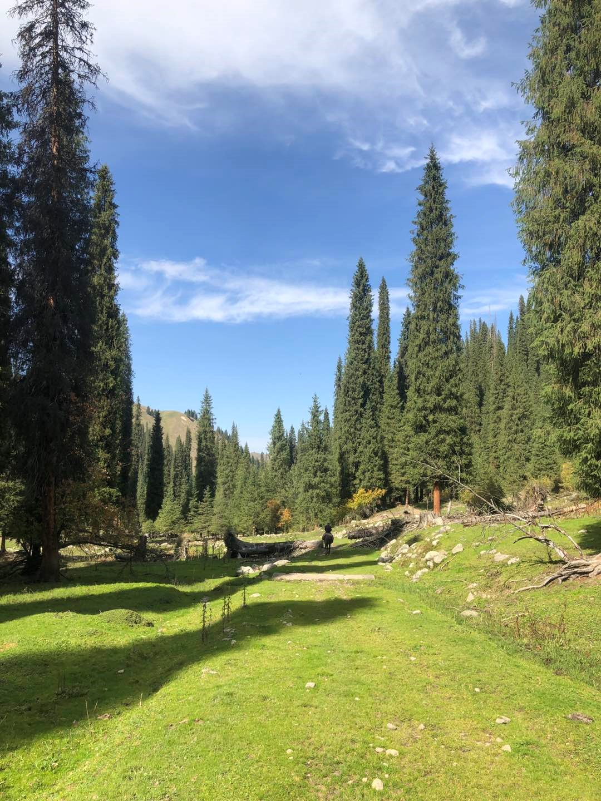
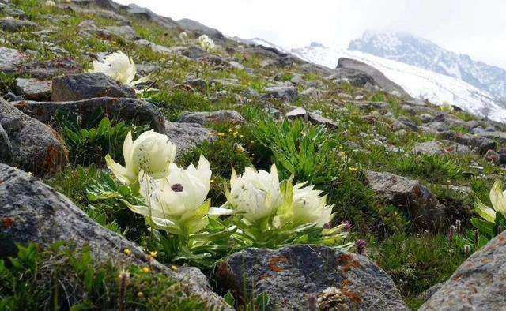
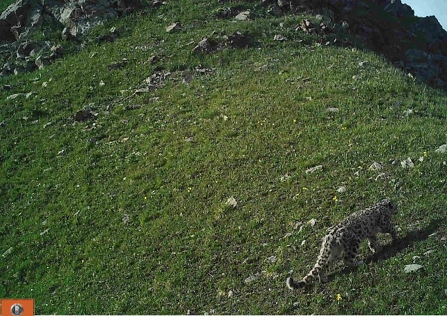
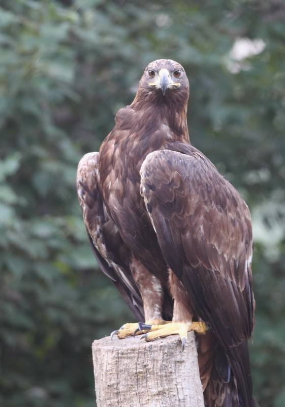

```{r setup, include=FALSE}
knitr::opts_chunk$set(echo = TRUE)
```

<br>

## Mt. West Tianshan (新疆西天山)

Mt. West Tianshan is located in the west of Xinjiang Uygur Autonomous Region. Our study sites is located within the Mt. West Tianshan National Nature Reserve (43°03′～43°15’N, 82°51′～83°06′E) and Wild Walnut Vally Provincial Nature Reserve. The total area of Mt. West Tianshan National Nature Reserve is 31217 km2, and the mountain peak is at 4257 m a.s.l. This region is mainly influenced by the temperate semiarid continental climate, with mean annual temperature varying from 5℃ to 7℃, and annual precipitation ranging from 600 mm to 800 mm.

<div align="center">
[](Pictures/Xitianshan-4.jpg){#id .class width=30% height=30%}

```{r DT, echo=FALSE, message=FALSE, warning=FALSE}
# example: https://www.earthdatascience.org/courses/earth-analytics/get-data-using-apis/leaflet-r/
library(dplyr)
library(ggplot2)
library(rjson)
library(jsonlite)
library(leaflet)
library(RCurl)
library(openxlsx)
dat <- read.xlsx("I:\\Research\\BEST\\BEST_Documents\\Locations_Best_Current.xlsx")
dat <- dat[which(dat$Name=="West Tianshan"),]
best_map <- leaflet() %>%
  addProviderTiles("Esri.NatGeoWorldMap") %>%
  addCircleMarkers(color = "red", stroke = FALSE, fillOpacity = 0.5, lng=dat$long, lat=dat$lat, popup=dat$NameCN)%>%
  setView(dat$long[1], dat$lat[1], zoom = 8)
best_map
```
</div>

<hr>

### **Vegetation**

Mt. West Tianshan has an obvious vertical distribution zone of vegetations, including desert vegetation (<1100m), Malus sieversii and Armeniaca vulgaris mixed forest (1100-1300m), Populus talassica and Picea schrenkiana mixed forest (1300-1500m), Picea schrenkiana forest (1500-2950m), snow line (ca. 3200m), alpine meadow and flowstone lands (2590-3500 m), and permanent snow and glacier zone (>3500 m). This mountain is well known for a large number of endangered or endemic plants, such as *Malus sieversii*, *Armeniaca vulgaris*, *Saussurea involucrate*, *Helianthemum songaricum*, and *Picea schrenkiana var. tianshanica*.

<div align="center">
[](Pictures/Xitianshan-15.jpg){#id .class width=30% height=30%}

The forest of *Picea schrenkiana*
<br>
 
[](Pictures/Xitianshan-6.jpg){#id .class width=30% height=30%}

Forest landscape in the elevation of ~ 1200 m
<br>

[](Pictures/Xitianshan-7.jpg){#id .class width=30% height=30%}

Forest landscape in the elevation of ~ 1500 m
<br>
 
[](Pictures/Xitianshan-1.jpg){#id .class width=30% height=30%}
</div>

<hr>


### **Flora**

According to the Biodiversity and Management of West Tianshan Mountain National Nature Reserve (Xiao, et al. 2015), there are 847 vascular plant species, belonging to 93 families and 390 genera.

<div align="center">
[](Pictures/Xitianshan-3.jpg){#id .class width=30% height=30%}

Xinjiang Wild Apple *(Malus sieversii)*

<br>

[](Pictures/Xitianshan-8.jpg){#id .class width=30% height=30%}

*Saussurea involucrate*
</div>

<hr>

### **Fauna**

The incomplete list of the Fauna of West Tianshan is below.

<div align="center">
[](Pictures/Xitianshan-9.png){#id .class width=30% height=30%}
Reference:
Xiao W.F. Yasheng A. Qian F.W. Xu H.X. Chen K.W. Liu W.C. 2015. Biodiversity and Management of West Tianshan Mountain National Nature Reserve, Xinjiang. China Forestry Publishing House, Beijing. 
Liu P., Kang L.J., Hou L.X., Tulson N. 2007. Fauna of terrestrial vertebrates in West Tianshan National Nature Reserve, Xinjiang. Endemic Diseases Bulletin, 22(41): 10-13.
<br>

[](Pictures/Xitianshan-10.jpg){#id .class width=30% height=30%}

*Panthera uncia*
<br>

[](Pictures/Xitianshan-11.jpg){#id .class width=30% height=30%}

*Capra sibirica*

[](Pictures/Xitianshan-16.jpg){#id .class width=30% height=30%}

[](Pictures/Xitianshan-19.jpg){#id .class width=30% height=30%}

[](Pictures/Xitianshan-17.JPG){#id .class width=30% height=30%}

[](Pictures/Xitianshan-18.jpg){#id .class width=30% height=30%}

</div>
<hr>

### **Research sites of BEST network**

In 2019, thirteen 20 m × 20 m plots along an elevational gradient were set up from 1200 m to 2800 m in West Tianshan National Nature Reserve. The plots were set at intervals of ~100 m in elevation. Within each plot, all woody stems with ≥ 1 cm DBH were tagged and identified to species. There were 981 individuals with DBH ≥ 1 cm recorded, belonging to 4 families, 7 genera and 8 species.

[](Pictures/Xitianshan-13.jpg){#id .class width=30% height=30%}
<br>

In 2019,  sixteen 20 m × 20 m plots along an elevational gradient were set up from 895 m to 1794 m inWild Walnut Vally Provincial Nature Reserve

[](Pictures/Xitianshan-14.png){#id .class width=30% height=30%}

[](Pictures/Xitianshan-21.JPG){#id .class width=30% height=30%}

[](Pictures/Xitianshan-20.JPG){#id .class width=30% height=30%}

<hr>

### **Principal Investigator**

Zhongping Tian (田中平): [tianzhongping007@163.com](mailto:tianzhongping007@163.com)

**Research Team**:

-   Dr. Zhaochen Zhang (East China Normal University)

-   Dr. Jian Zhang (East China Normal University)

<hr>

### **Selected Publications**

Coming soon.
<hr>

### **Site Support**

This site has been supported by:

-   National Natural Science Foundation of China

-   School of Ecological and Environmental Sciences, East China Normal University

-   West Tianshan National Nature Reserve

<hr>