```{r setup, include=FALSE}
knitr::opts_chunk$set(echo = TRUE)
```

<br>

## Mt. Yulong (云南玉龙雪山)

Mt. Yulong (27°10′–27°40′N, 100°09′–100°20′E) , also named as Jade Dragon Snow Mountain, is located in the northwest of Yunnan province, China. It is located the southeast of the Hengduan Mountains and has a total area of 260 km2. The mountain peak is at 5596 m a.s.l., and it is the southernmost glacierized area in North Hemisphere which is extremely sensitive to climate change. The weather is monsoon climate which include a dry season from November to May and a rainy season from June to October. The mean annual temperature at Yulong Mountain is 12.8°C, and the average annual precipitation is 935 mm.
<br>

<div align="center">
```{r DT, echo=FALSE, message=FALSE, warning=FALSE}
# example: https://www.earthdatascience.org/courses/earth-analytics/get-data-using-apis/leaflet-r/
library(dplyr)
library(ggplot2)
library(rjson)
library(jsonlite)
library(leaflet)
library(RCurl)
library(openxlsx)
dat <- read.xlsx("I:\\Research\\BEST\\BEST_Documents\\Locations_Best_Current.xlsx")
dat <- dat[which(dat$Name=="Yulongxueshan"),]
best_map <- leaflet() %>%
  addProviderTiles("Esri.NatGeoWorldMap") %>%
  addCircleMarkers(color = "red", stroke = FALSE, fillOpacity = 0.5, lng=dat$long, lat=dat$lat, popup=dat$NameCN)%>%
  setView(dat$long[1], dat$lat[1], zoom = 8)
best_map
```
</div>

<div align="center">
{width="20cm"}

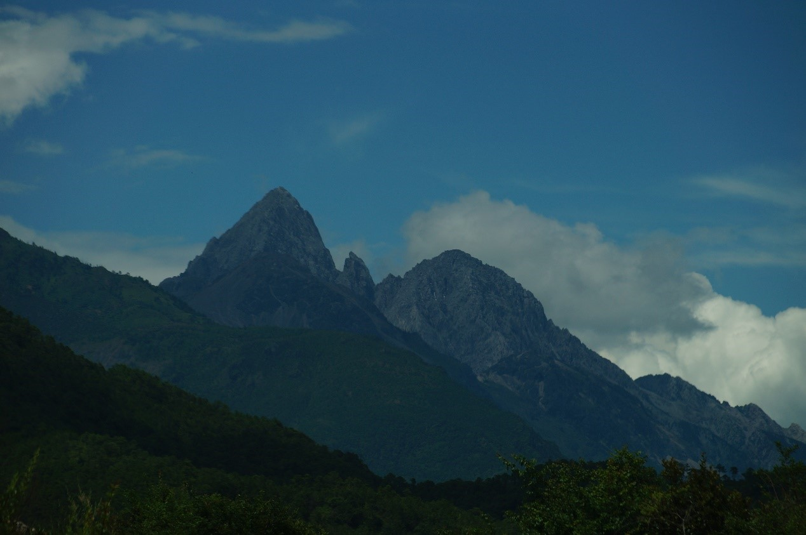{width="20cm"}

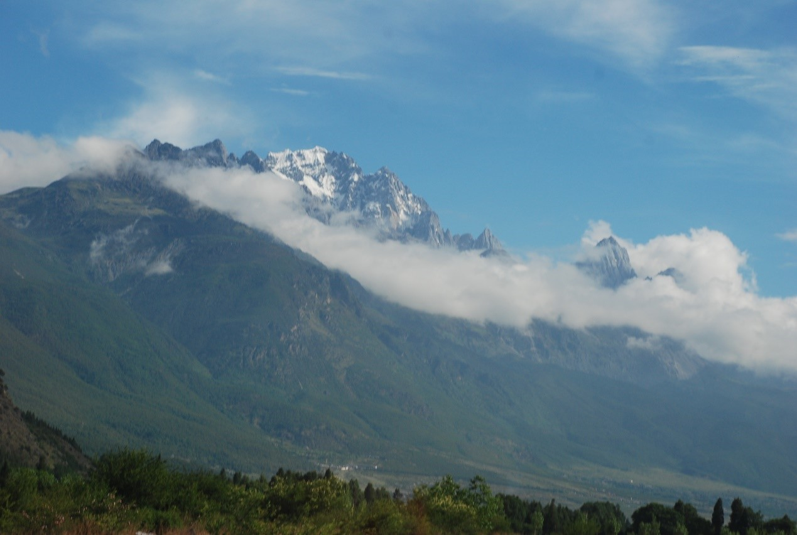{width="20cm"}

{width="20cm"}

{width="20cm"}

{width="20cm"}

</div>

<hr>

### **Vegetation**

Five distinct vegetation types were observed along elevations in our study region. *Pinus armandii* forest (2600- 2800 m); *Pinus armandii*, *Pinus yunnanensis* and *Quercus spinosa* mixed forest (2800-3000 m); *Pinus yunnanensis* and *Quercus guyavifolia* mixed forest (3000-3500m); *Quercus aquifolioides* forest (3500-3700m); and *Quercus aquifolioides*, *Abies georgei* and Rhododendron forest (3700-3900 m).

<div align="center">

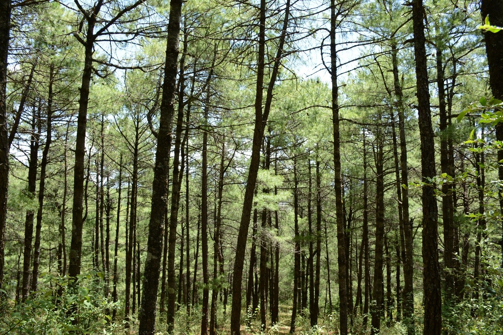{width="20cm"}

*Pinus armandii* forest

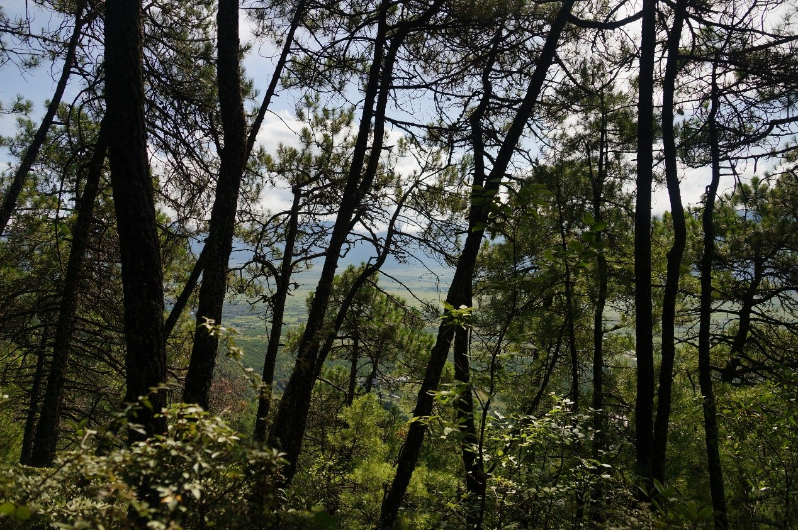{width="20cm"}

*Pinus armandii*, *Pinus yunnanensis* and *Quercus spinosa* mixed forest

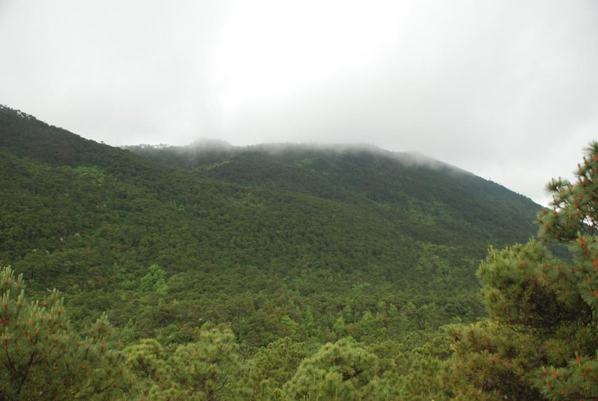{width="20cm"}

*Pinus yunnanensis* forest

{width="20cm"}

*Pinus yunnanensis* and *Quercus guyavifolia* mixed forest

{width="20cm"}

*Quercus guyavifolia* forest

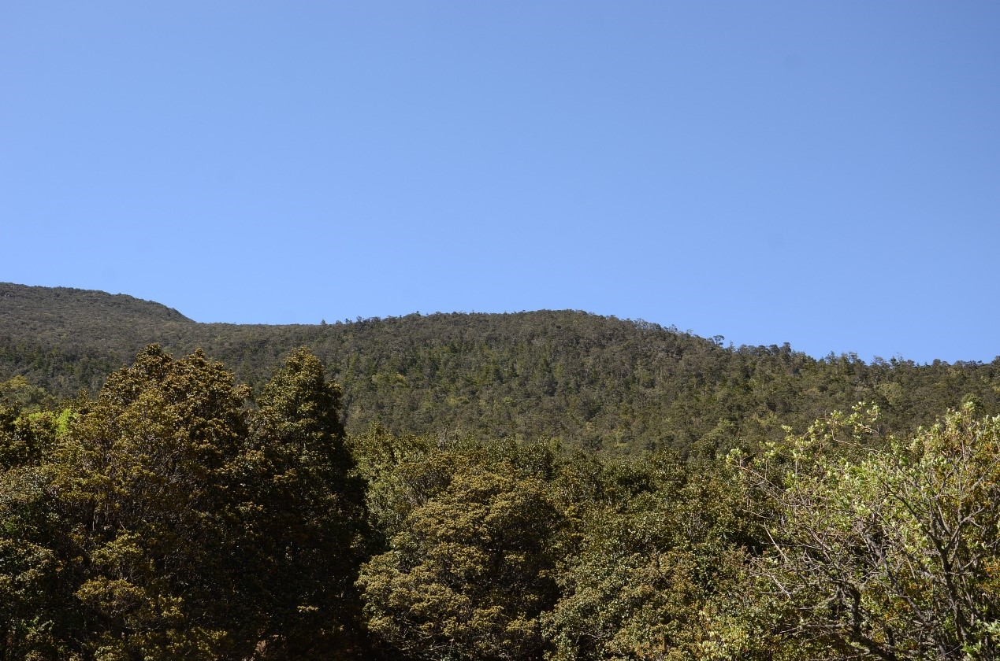{width="20cm"}

*Quercus aquifolioides* forest

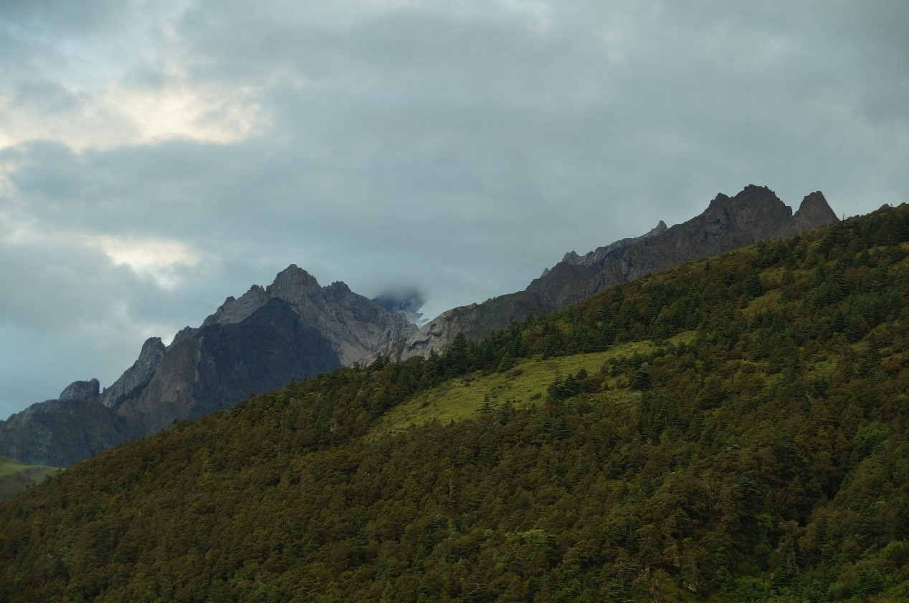{width="20cm"}
{width="20cm"}
{width="20cm"}
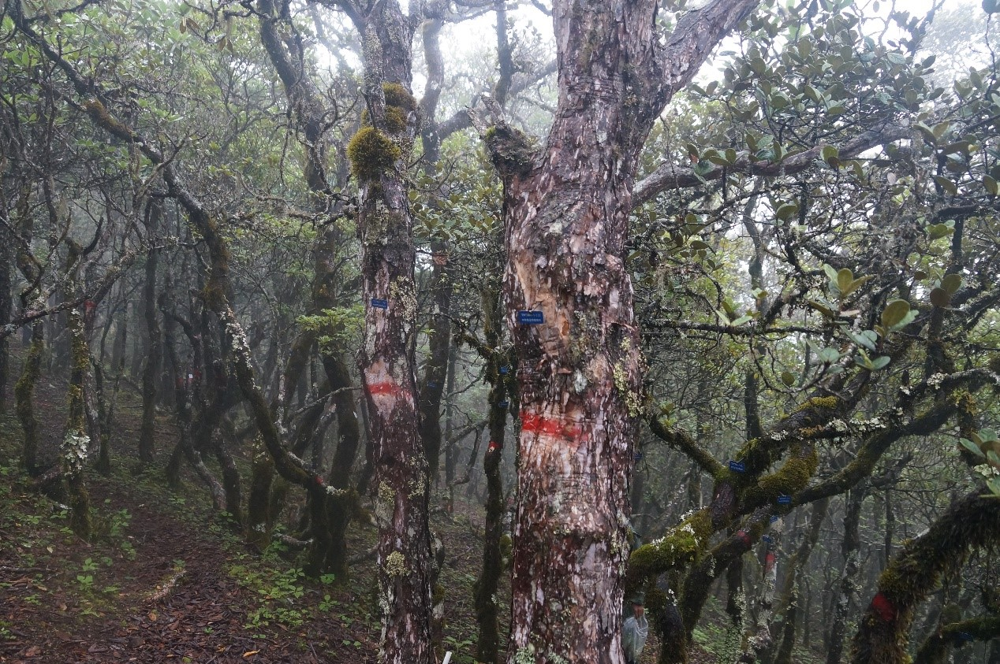{width="20cm"}


*Quercus aquifolioides*, *Abies georgei* and Rhododendron forest


</div>
<hr>

### **Flora**

In Yulong mountains, a total of 2028 native seed plant species from 625 genera and 136 families. More than half of the species are herbaceous (66.4 %; 82 families; 426 genera; and 1346 species), and 33.6 % are woody species (290 tree species from 120 genera and 56 families, and 392 shrub species from 133 genera and 62 families; Wang et al. 2007).

<hr>

### **Research sites of BEST network**

In 2013-2014, Nineteen 20 m × 50 m plots along an elevational gradient were set up from 2650 m to 3850 m above the sea level in this mountain. The plots were set based on the distinct vegetation types. Within each plot, all woody stems with ≥ 1 cm DBH were tagged and identified to species. There were individuals with DBH ≥ 1 cm recorded, belonging to 22 families, 46 genera and 59 species. Meanwhile, a total of 101 shrub species and 201 herbaceous species were observed in our study plots.

<div align="center">
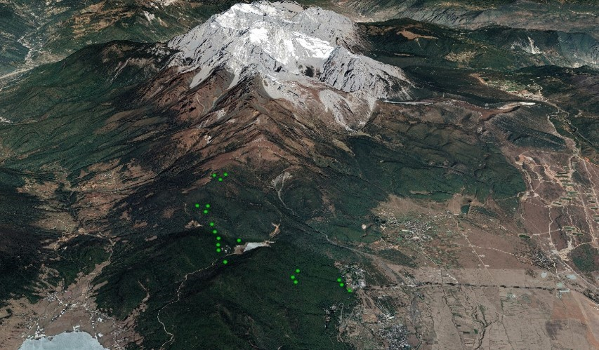{width="20cm"}

The location of 19 long-term monitoring plots along elevation

{width="20cm"}

The establishment of forest plots in Yulong Mountain

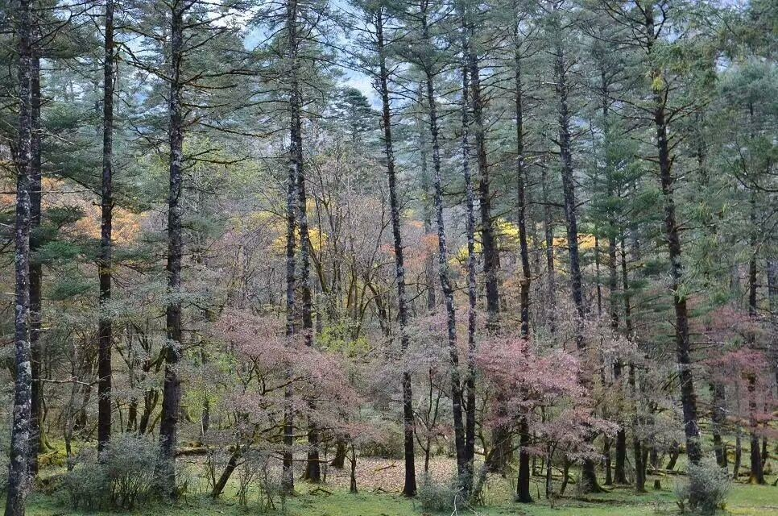{width="20cm"}

Distinct forest strata (trees, shrubs and herbs)


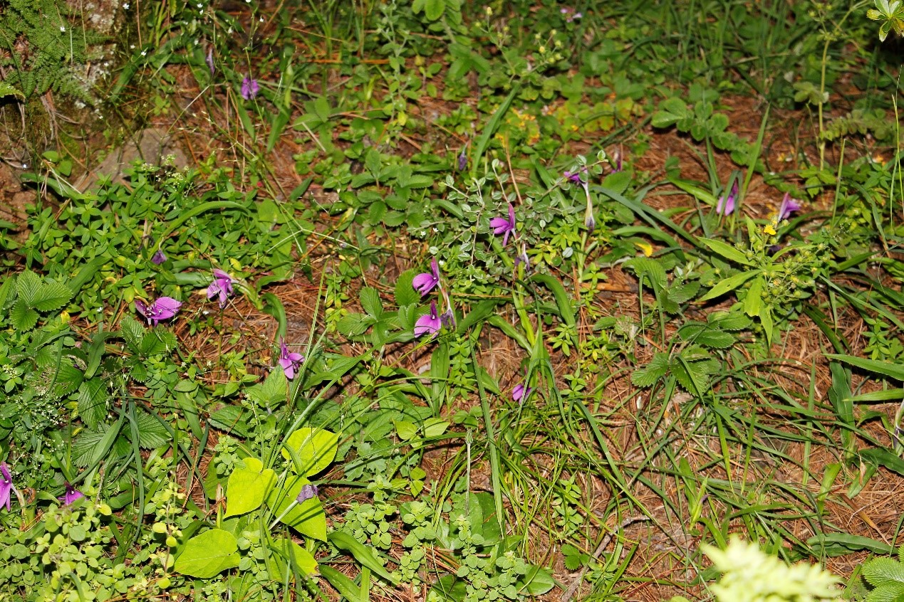{width="20cm"}

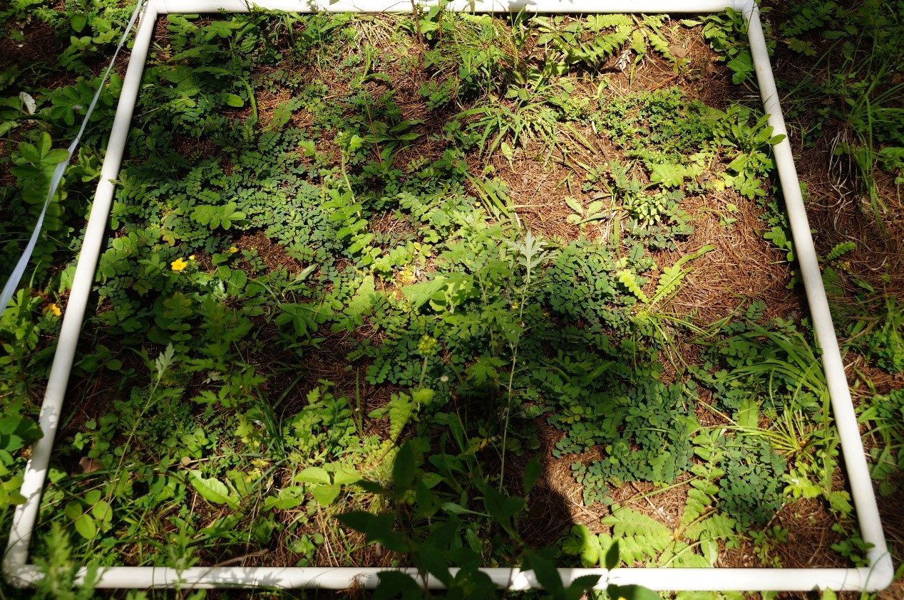{width="20cm"}

Herbaceous species investigation
</div>

<hr>

### **Principal Investigator**

Yahuang Luo (罗亚皇): [luoyahuang@mail.kib.ac.cn](mailto:luoyahuang@mail.kib.ac.cn)

Jie Liu (刘杰): [liujie@mail.kib.ac.cn](mailto:liujie@mail.kib.ac.cn)

<hr>

### **Selected Publications**

(1) **Ya-Huang Luo**, Marc W. Cadotte, Kevin S. Burgess, **Jie Liu**, Shao-Lin Tan, Kun Xu, Jia-Yun Zou, De-Zhu Li*, Lian-Ming Gao*. Greater than the sum of the parts: how the species composition in different forest strata influence ecosystem function. *Ecology Letters*. 2019. 22: 1449–1461. 
(2) **Ya-Huang Luo**, Marc W. Cadotte, Kevin S. Burgess, **Jie Liu**, Shao-Lin Tan, Kun Xu, De-Zhu Li*, Lian-Ming Gao*. Forest community assembly is driven by different strata-dependent mechanisms along an elevational gradient. *Journal of Biogeography*. 2019. 46: 2174– 2187. 
(3) **Ya-Huang Luo**, **Jie Liu**, Shao-Lin Tan, Marc W. Cadotte, Yue-Hua Wang, Kun Xu, De Zhu Li*, Lian-Ming Gao*. Trait-based community assembly along subalpine elevational gradients: Quantifying the roles of environmental factors in inter- and intraspecific variability. *PLoS ONE*. 2016. 11: e0155749. 
(4) **Ya-Huang Luo**, **Jie Liu**, Shao-Lin Tan, Marc W. Cadotte, Kun Xu, Lian-Ming Gao *, De-Zhu Li *. Trait variation and functional diversity maintenance of understory coexisting herbaceous species along elevational gradient in Yulong Mountain, Southwest China. *Plant Diversity*. 2016. 38: 303-311.


<hr>

### **Site Support**

This site has been supported by:

-   Lijiang National Field Research Station of Forest Ecosystem, Kunming Institute of Botany, Chinese Academy of Sciences

-   National Natural Science Foundation of China

<hr>