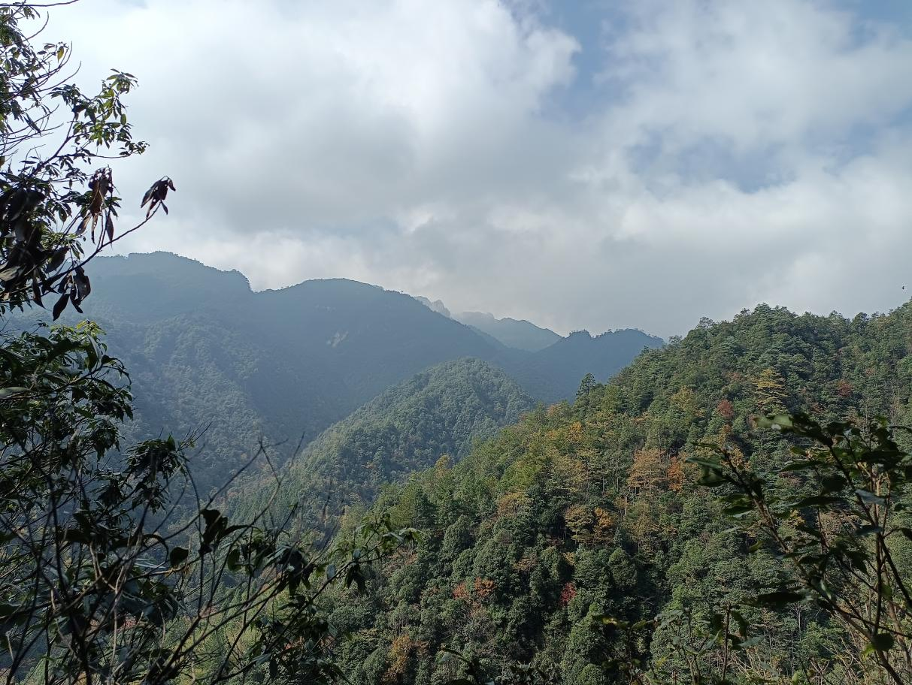

```{r setup, include=FALSE}
knitr::opts_chunk$set(echo = TRUE)
```

<br>

## Mt. Nanling (南岭)

Nanling is located in the Nanling National Nature Reserve (112º30′-113º04′E, 24º37′-24º57′N), a central part of Nanling mountains and establishing Nanling National Park, of China. It has a mid-subtropical monsoon climate, with sufficient heat, abundant rainfall, and high humidity. It has an average annual temperature of 17.7 ℃, an average annual precipitation of 1705 mm, and an average relative humidity of 84%.

<div align="center">
```{r DT, echo=FALSE, message=FALSE, warning=FALSE}
# example: https://www.earthdatascience.org/courses/earth-analytics/get-data-using-apis/leaflet-r/
library(dplyr)
library(ggplot2)
library(rjson)
library(jsonlite)
library(leaflet)
library(RCurl)
library(openxlsx)
dat <- read.xlsx("I:\\Research\\BEST\\BEST_Documents\\Locations_Best_Current.xlsx")
dat <- dat[which(dat$Name=="Bawangling"),]
best_map <- leaflet() %>%
  addProviderTiles("Esri.NatGeoWorldMap") %>%
  addCircleMarkers(color = "red", stroke = FALSE, fillOpacity = 0.5, lng=dat$long, lat=dat$lat, popup=dat$NameCN)%>%
  setView(dat$long[1], dat$lat[1], zoom = 8)
best_map
```
</div>

<hr>

### **Vegetation**

The Nanling National Nature Reserve contains nine vegetation types dominated by subtropical evergreen broad-leaved forests.

[](Pictures/Nanling-1.jpg){#id .class width=30% height=30%}

<hr>

### **Flora**

There are 3890 vascular plant species, belonging to 1262 genera and 287 families in the nature reserve. Two and 66 plant species belong to the first and second class protected plants of China, respectively.

<hr>

### **Fauna**

There are 636 vertebrate species and 3195 insect species in the nature reserve. 17 vertebrate species belong to the first class protected animals of China.

<hr>

### **Research sites of BEST network**

In 2020-2024, 78 20 m × 20 m plots were set up along an elevational gradient from 600 m to 1800 m, with six plots per 100 m. Within each plot, all wood stems with ≥ 1 cm DBH were tagged and identified to species. There were 15880 individuals with DBH ≥ 1 cm recorded, belonging to 276 species from 129 genera and 61 families.
In 2020, one 400 m × 500 m plot was set up from 1008 m to 1254 m (The Nanling 20-ha Forest dynamics Plot). All wood stems with ≥ 1 cm DBH were tagged and identified to species within the plot. There were 132905 individuals with DBH ≥ 1 cm recorded, belonging to 229 species from 127 genera and 63 families.

<hr>

### **Principal Investigator**

Qiang Zhang (张强): [zhangqiang06@giz.gd.cn](mailto:zhangqiang06@giz.gd.cn)

Yuxin Chen (陈宇新): [yuxin.chen@xmu.edu.cn](mailto:yuxin.chen@xmu.edu.cn)

**Research Team**:

-  Yong Shen (Institute of Zoology, Guangdong Academy of Sciences)

-  Qing Quan (Institute of Zoology, Guangdong Academy of Sciences)

-  Haolin Wu (Institute of Zoology, Guangdong Academy of Sciences)

-  Qiuyan Peng (Institute of Zoology, Guangdong Academy of Sciences)

-  Wenbin Li (Xiamen University)

-  Xinfeng Chen (Xiamen University)

-  Siqing Fang (Xiamen University)

-  Yiyang An (Xiamen University)

-  Yudi Hua (Xiamen University)

-  Zhifa Liu (Xiamen University)


<hr>

### **Selected Publications**

1) Shen Y, Gong YN, Mei QM, Liu ZF, Wu LF, Zhang Q. Guangdong Nanling Subtropical Forest Dynamics Plot: Tree Species and Their Distribution Patterns [M]. China Forestry Publishing House. 2024.

2) Shen Y, Marcel H, Eben G, Christos M, Zou FS, Chen YX, Zhang CM, Quan Q, Zhang Q*. Mixed-species bird flocks re-assemble interspecific associations across an elevational gradient. Proceedings of the Royal Society B: Biological Sciences 2022, 289(1989), 20221840.

3) Zhang Q, Marcel H, Eben G, Liu ZF, Liu JJ, Shen Y, Zhang M, Dong AQ, Zou FS*. Trait–environment relationships differ between mixed-species flocking and non-flocking bird assemblages. Ecology. 2020, 101(10), e03124

4) Zhang Q, Marcel H, Chen CW, Zou FS*. Trait-mediated filtering drives contrasting patterns of species richness and functional diversity across montane bird assemblages. Journal of Biogeography. 2020, 47(1): 301-312.

5) Gong YN, Liu ZF, Shui KC, Zhang Q, Wu LF, Guo TH, Quan Q, Shen Y*. Spatial distribution and habitat characteristic of Pinus kwangtungensis in the Guangdong Nanling 20 hm2 forest dynamics plot. Guihaia. 2022, 42(7): 1204-1212.

6) Liu ZF, Wang XC, Gong YN, Chen DJ, Zhang Q*. Diversity and elevational distribution of birds and mammals based on infrared camera monitoring in Guangdong Nanling National Nature Reserve. Biodiversity Science. 2023, 31, 22689. 


<hr>

### **Site Support**

This site has been supported by:

-   National Natural Science Foundation of China

-   Institute of Zoology, Guangdong Academy of Sciences

-   College of the Environment and Ecology, Xiamen University

-   Nanling National Nature Reserve

-   Forestry Administration of Guangdong Province


<hr>