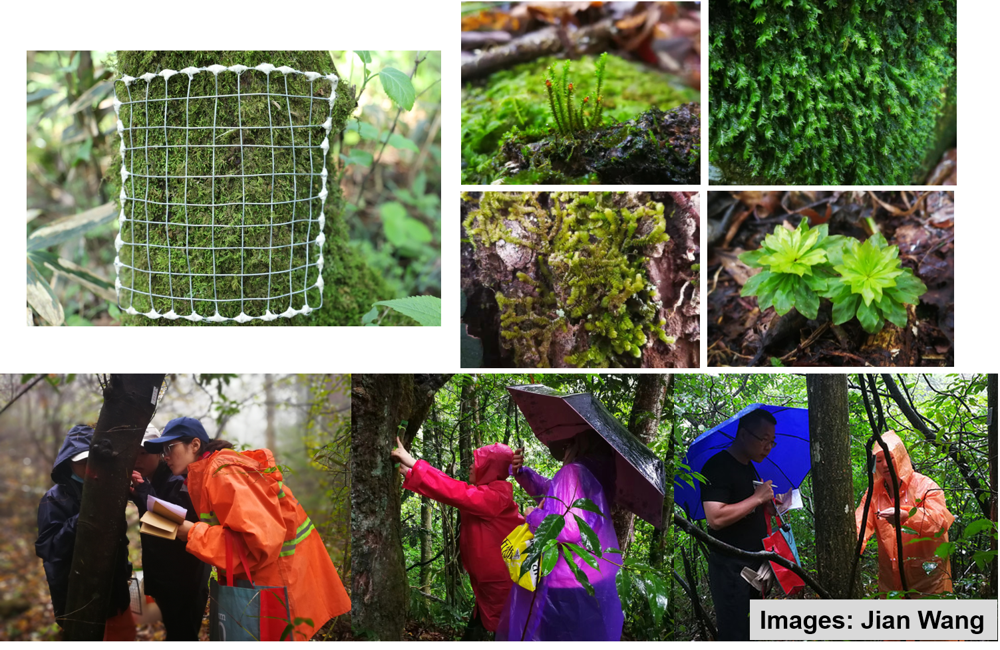
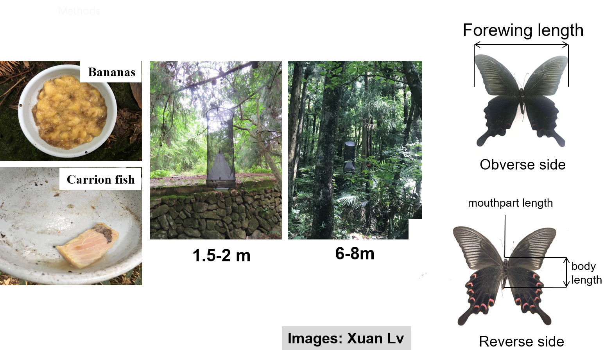
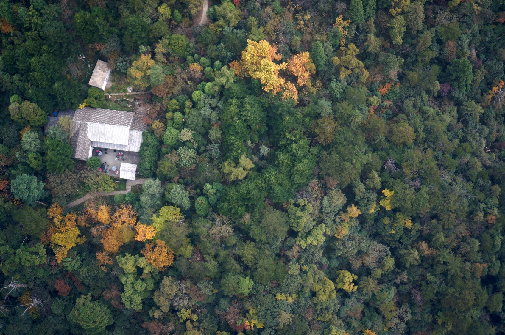
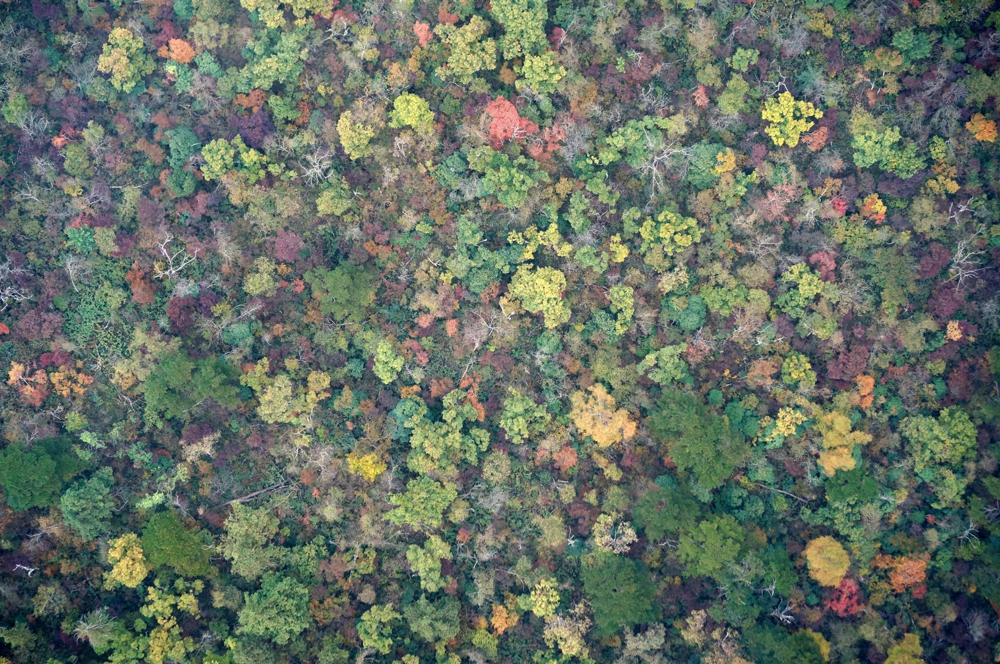

```{r setup, include=FALSE}
knitr::opts_chunk$set(echo = TRUE)
```

<br>


<br>

## Current Ongoing Projects

**More details will add later. Please contact us if you have questions or suggestoins.**

* Woody plant diversity

* Bryophytes

* Butterfly

* Microbes


<hr>
## Field Protocols

**More details will add later.**

<br>

+ Woody plant survey
[](Pictures/FieldSurvey-1-1.jpg){#id .class width=30% height=30%}

+ Understory plant survey
[](Pictures/FieldSurvey-2.jpg){#id .class width=30% height=30%}

+ Bryophyte diversity survey
[](Pictures/FieldSurvey-3.png){#id .class width=30% height=30%}

+ Butterfly diversity survey
[](Pictures/FieldSurvey-4.png){#id .class width=30% height=30%}

[](Pictures/FieldSurvey-5.png){#id .class width=30% height=30%}

+ Microclimate monitoring

+ Drone Survey
[](Pictures/FieldSurvey-6.jpg){#id .class width=30% height=30%}

[](Pictures/FieldSurvey-7.jpg){#id .class width=30% height=30%}

<hr>

## Fundings

+ 2021-2024 Research Grant from NSFC (Natural Science Foundation of China) on Bryophyte diversity along elevational gradients（国家自然科学基金面上项目“中国亚热带山地苔藓植物多样性海拔梯度分布模式及影响机制”）(**PI: Jian Wang**)

+ 2021-2024 Research Grant from NSFC (Natural Science Foundation of China) on the effect of plant-soil fungi feedback on forest diversity-productivity relationship along elevational gradients（国家自然科学基金面上项目“植物-土壤真菌反馈对高黎贡山海拔梯度森林多样性—生产力关系的影响”）(**PI: Yahuang Luo**)

+ 2021-2024 Research Grant from NSFC (Natural Science Foundation of China) on Plant diversity along elevational gradients（国家自然科学基金面上项目“森林垂直结构和微气候对植物多样性海拔梯度格局的影响机制”）(**PI: Jian Zhang**)

+ 2021-2023 Research Grant from the Natural Science Foundation of Shanghai on Plant diversity along elevational gradients（上海自然科学基金面上项目“长江流域山地植物多样性的联网研究”）(**PI: Jian Zhang**)
